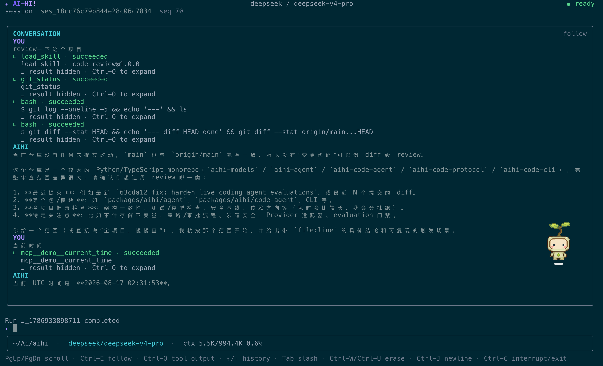

# @aihi/code-cli

[English] | [简体中文](README.zh-CN.md)

Local TypeScript/Ink terminal UI for the AIHI coding-agent Worker.

The CLI launches the Python `aihi-code-agent` Worker, performs the protocol `0.3` handshake, renders durable and live events, and provides the interactive controls expected from a small coding-agent CLI. It is a private workspace app rather than a published npm library.

## Features

- Workspace-aware sessions backed by a SQLite event store.
- New, continue, open, fork, resume, interrupt, and cancel workflows.
- Provider and model pickers, approval prompts, Skill/MCP/tool inspection, and `/doctor` diagnostics.
- Content-Length framed JSON-RPC over a local Worker process; reconnect and event replay use the same transcript projector.
- Multiline composer, command suggestions, scrollable transcript, tool previews with credential redaction, and light/dark terminal themes.

## Architecture

```text
Ink TUI (React)
      │
      ▼
RpcClient ── Content-Length framed JSON-RPC 2.0 ── stdin/stdout
                                                        │
                                                        ▼
                                   aihi-code-agent Worker (Python)
                                                        │
                                                        ▼
                                   SQLite events + configured workspace
```

The TUI owns presentation and user interaction. The Worker owns configuration, provider/runtime composition, tools, Skills, MCP, approvals, and durable state. Protocol DTOs and schemas are shared through [`@aihi/code-protocol`](../../packages/aihi/code-protocol/README.md).

## Requirements

- Node.js 20 or newer
- pnpm 9
- Python 3.11 or newer
- A separately editable-installed `aihi-code-agent-worker`

## Install and build

From the repository root:

```bash
uv sync
pnpm install
uv pip install -e packages/aihi/code-agent
pnpm --filter @aihi/code-cli build
```

The Python Worker is a private local application outside the uv workspace, so the editable install above
is required. It is not published to PyPI; the public Python distributions are `aihi-models` and
`aihi-agent`.

## Run

Start an interactive session in a project:

```bash
node apps/aihi-code-cli/dist/main.js --workspace /path/to/project
```

After the package is linked or exposed on `PATH`:

```bash
aihi-code --workspace /path/to/project
aihi-code --continue --workspace /path/to/project
aihi-code --session SESSION_ID --workspace /path/to/project
aihi-code --workspace /path/to/project summarize the auth module
```

`--workspace` is the readable alias for `--cwd`; both default to the current directory. The default event store is `~/.aihi/sessions.sqlite3`. `--store` is available for tests and advanced isolation, but it does not change the configuration directory.

## Example session

The CLI renders streamed progress, tool results, Skill loading, and a
resumable session header while the Python Worker owns runtime state:



### Command-line options

| Option | Meaning |
| --- | --- |
| `--workspace PATH` | Workspace to operate in; alias for `--cwd` |
| `--cwd PATH` | Workspace path (default: current directory) |
| `--store PATH` | SQLite event store (default: `~/.aihi/sessions.sqlite3`) |
| `--provider NAME` | Provider profile for the first/new session |
| `--model NAME` | Model from the selected provider for the first/new session |
| `--session ID` | Open a known session |
| `--continue`, `-c` | Open the newest session for the workspace |
| `PROMPT...` | Run a first user turn after startup |

## Slash commands

Type `/help` in the TUI to see the current command list. The main commands are:

| Area | Commands |
| --- | --- |
| Sessions | `/new`, `/open`, `/sessions`, `/history`, `/refresh`, `/fork`, `/quit` |
| Runs | `/run`, `/runs`, `/resume`, `/cancel`, `/interrupt` |
| Models | `/providers`, `/models`, `/provider`, `/model`, `/status` |
| Approvals | `/approvals`, `/approve ID [once]`, `/deny ID` |
| Configuration | `/config`, `/doctor` |
| Integrations | `/skills`, `/skill-trust`, `/skill-disable`, `/skill-untrust`, `/mcp`, `/tools` |
| Tasks | `/task`, `/task-start`, `/task-done`, `/task-cancel` |

Approving or denying a tool request resolves the Worker-owned approval and then resumes the run so the model receives the resulting `ToolResult`. A session has at most one foreground run; `Ctrl-C` interrupts that run and exits when no run is active.

## Configuration

The Worker checks these fixed locations, in increasing precedence:

1. `~/.aihi/aihi-code.toml`
2. legacy project-root `aihi-code.toml`
3. `<workspace>/.aihi/aihi-code.toml`

The CLI, Worker RPC, and environment do not accept a configuration-path override. Relative paths are anchored to the file that declares them. A typical project configuration is:

```toml
[provider]
name = "deepseek"
models = ["deepseek-chat", "deepseek-reasoner"]
api_key_env = "DEEPSEEK_API_KEY"

[providers.openai]
models = ["gpt-4o", "gpt-4.1"]
api_key_env = "OPENAI_API_KEY"

[sandbox]
backend = "host"
unsafe = false

[agent]
access_mode = "workspace_write" # read_only | workspace_write | full_access
run_mode = "execute"            # execute | plan

[audit]
enabled = true
path = "audit.jsonl"

[[skills.roots]]
path = "skills"
scope = "project"

[skills]
load_tool = true

[mcp.servers.example]
command = ["python3", "-m", "example_mcp_server"]
allowed_tools = ["search"]
```

API keys are referenced by environment variable name and are not stored in TOML. The generated user configuration keeps Host execution disabled. If Host mode is selected, the TUI requests consent for the exact Session workspace; the acknowledgement is stored in `~/.aihi/host-workspaces.json`. Host mode is not process or filesystem isolation: commands run as the local user with the workspace as cwd and may access any OS-permitted file or network resource.

Use `/providers` to display the configured provider catalog, `/providers NAME` to select a provider, `/models` to display every provider/model pair, and `/models PROVIDER/MODEL` to switch both values. `/provider` and `/model` remain compatibility aliases. The startup banner, `/config`, `/status`, `/doctor`, `/runs`, and status bar display the effective Access/Run Mode. Configured modes are shown before the first Run; persisted Run modes take precedence after replay or a live `run.started` event.

## Sessions and recovery

The Worker persists canonical events; the CLI replays `session.events` and feeds replayed and live notifications through the same transcript projector. Temporary model chunks are rendered while a run is active, but only the canonical assistant message is durable. `/history` reloads persisted events, `/refresh` replays the current session, and `/fork [SEQ]` creates a branch.

`PageUp`/`PageDown` scroll the transcript, `Ctrl-E` follows the newest output, and `Ctrl-O` expands or collapses tool details. The composer supports pasted or `Ctrl-J`-inserted multiline prompts, local history with `Up`/`Down`, and slash completion with `Tab`/`Shift-Tab`.

## Diagnostics and security

`/doctor` checks resolved configuration, provider metadata, session-scoped tools/MCP/Skills, audit destination writability, and Host consent state. Audit observations are redacted, bounded, and written with owner-only permissions by the Worker. Tool previews use an allowlist and credential-shaped substrings are redacted before display.

Review both authority dimensions before enabling edits or process execution:

- `read_only`: mutation and process execution are denied.
- `workspace_write`: local application-owned file edits run; Bash and other external mutations ask.
- `full_access`: privileged tools run after hard safety checks.
- `plan`: an independent hard read-only Run intent that approval cannot upgrade; `execute` applies the configured AccessMode.

## Development

```bash
pnpm --filter @aihi/code-cli typecheck
pnpm --filter @aihi/code-cli test
pnpm --filter @aihi/code-cli build
```

Protocol changes should update the Worker, [`@aihi/code-protocol`](../../packages/aihi/code-protocol/README.md), CLI tests, and compatibility handshake together.

## Related documentation

- [`aihi-code-agent`](../../packages/aihi/code-agent/README.md)
- [`aihi-agent`](../../packages/aihi/agent/README.md)
- [Repository architecture](../../docs/ARCHITECTURE.md)
