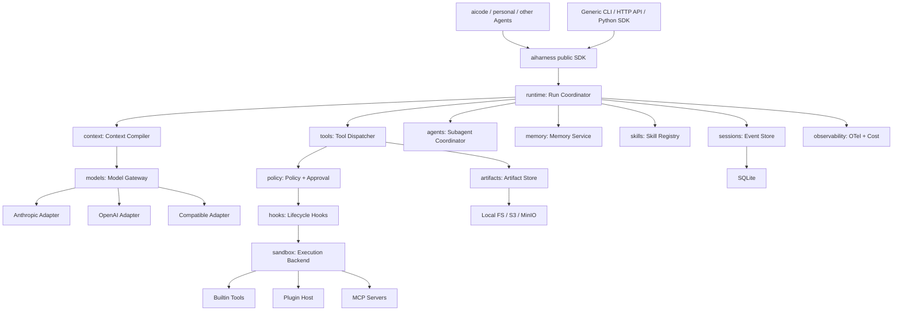

# AIHarness 架构设计

状态：Accepted
版本：v0.2
日期：2026-08-08

本文件只描述**稳定契约**：不变式、边界和协议。里程碑顺序与完成进度属于
[TASK.md](TASK.md)，单次决策的取舍属于 `docs/adr/`。任何以「当前 Mx 提供…」开头的段落
都说明它写错了地方。

## 1. 定位与目标

AIHarness 是面向多种 Agent 的可复用运行时基础设施。模型只负责生成意图，Harness 负责公共
运行时能力；具体 Agent 产品通过应用层组合 Harness。模型不是系统事实源，事件日志才是。

当前规划分为两层：

- `aiharness`：可嵌入 SDK，提供公共协议、实现、安全边界和可恢复运行时；它是库，不带 CLI；
- `aicode/`、`personal/` 等应用：直接复用 Harness 的 Provider、Tool、Policy、Sandbox、Runtime
  和 Context，负责 Prompt、Agent 角色、工具集合、项目规则、交互和产品默认值。

Harness 不复制或内置某个产品 Agent；应用层也不得复制 Harness 实现。

AIHarness 负责：

- 持久化会话、恢复、分支和审计；
- 上下文预算、自动压缩和大型输出管理；
- Provider 适配、多模型路由和成本控制；
- 工具注册、插件、MCP、Skill、Hook 和 Subagent；
- 策略决策、审批、能力租约和沙箱执行；
- 记忆、评估、事件回放和可观测性。

### 1.1 非目标

- 不在核心层绑定某个模型厂商或 Agent 编排框架；
- 不把完整历史覆盖成摘要；
- 不把第三方插件代码直接加载进 Harness 主进程；
- 不把 Host 执行描述成真正的安全隔离；
- 不在第一阶段构建复杂 TUI、聊天渠道或控制台。
- 不把 Coding Agent、个人助理或其他具体 Agent 的 Prompt、项目规则、角色编排和 CLI 交互写进
  基础层。

## 2. 总体拓扑



控制面决定执行计划和上下文；执行面承载有副作用的工具、Hook 和插件。所有副作用必须
经过 `tools → policy → hooks → sandbox` 链路。

应用层只负责组装，不建立第二套 Runtime。典型 Coding Agent 组合是：

```text
aicode config / Prompt / AGENTS.md / terminal approval
  → aiharness Provider + Context + ToolRegistry + Policy + HostBackend
  → aiharness RunCoordinator + Session/EventStore
```

`aicode` 通过 `from aiharness import ...` 取得 Provider、Tool、Policy、Sandbox、Runtime 和
`RuntimeExtensions`；是否注册 Edit/Shell/Test、选择哪个模型、如何展示 Approval 和是否组合
Skill/Memory，由应用自行决定（见 §3.1 公共 API 边界）。

## 3. 工程目录

```text
src/aiharness/
  core/                 # Canonical types, events, IDs, errors
  runtime/              # Agent state machine, run coordinator
  sessions/             # Event store, snapshots, branching
  context/              # Context compiler and compaction strategies
  models/               # Gateway, router, provider adapters
  tools/                # Tool contract, registry, dispatcher
  plugins/              # Manifest, discovery, plugin host
  policy/               # Rules, decisions, approvals, capability leases
  hooks/                # Lifecycle event bus
  sandbox/              # Backend protocols and implementations
  memory/               # Extraction, retrieval, scopes
  skills/               # SKILL.md discovery and loading
  agents/               # Subagent task graph and coordination
  artifacts/            # Large output and patch storage
  observability/        # OTel, logging, cost accounting
  evals/                # Datasets, replay, graders
aicode/
  src/aicode/            # Coding Agent composition, CLI and product workflows
  tests/                 # Coding Agent acceptance and product tests
personal/
  src/personal_agent/    # Optional personal Agent composition
  tests/
tests/
  unit/
  contract/
  integration/
  security/
  evals/
docs/
  rfcs/
  adr/
plugins/
examples/
```

依赖方向：`core` 不依赖其他业务包；领域包依赖 `core`；`runtime` 组装依赖；
`aicode` 和其他应用依赖 `aiharness`，反向依赖一律禁止。Runtime 和领域
包内部通过 Provider、Sandbox、Store、Plugin Host 等 Protocol 访问实现；应用组合层可以实例化
Harness 已有的具体实现并注入。`aiharness/agents` 表示 Subagent 协调基础设施，不是用户可执行
Agent 的应用目录。

Runtime 通过 `RuntimeExtensions` 组合可选能力：`ContextContributor` 贡献只读上下文段落，
`RunRecorder` 观察已完成的 Run 并追加自己的审计事件。两者都是结构化 Protocol，能力包不 import
`runtime`，`runtime` 也不 import 能力包。当前已接线：Skill 索引、Memory 读取与候选抽取（ADR-0022）。Subagent 走另一条路径：
它是普通工具 `task`，因此派生子 Run 同样经过 `tools → policy → hooks → sandbox`；
子 Run 拥有独立 Session，权限模式取父子中更严格者（ADR-0023）。未接线：Plugin、MCP。

### 3.1 Harness 与应用层边界

| 层 | 负责 | 不负责 |
|---|---|---|
| `aiharness` | Canonical 类型、Runtime、Session、Provider、Tool、Policy、Sandbox、Context、Memory、Skill、Subagent、Eval、Observability | Coding Prompt、AGENTS.md 产品规则、具体 Agent 角色、终端 UI、产品凭据和应用默认工具集合 |
| `aicode` | Coding Agent 组装、真实 Provider 配置、Coding 工具选择、项目上下文、Approval UX、Coding Memory/Subagent 工作流 | 复制 Runtime、Provider、Policy、Sandbox 或 Event Store 实现 |
| `personal/` 等 | 各自 Agent 的 Prompt、角色、工具组合、交互和产品策略 | 直接修改另一个 Agent，或绕过 Harness 的工具/策略/沙箱链路 |

基础实现可以直接复用，不需要搬移或复制：例如 `aicode` 直接实例化已有 Provider，创建
`ToolRegistry`，注册已有工具，注入 `DefaultPolicyEngine` 和 `HostBackend`，再构造
`RunCoordinator`。只有跨应用可复用的缺口才进入 Harness H-* Backlog；应用专属逻辑留在应用目录。

#### 公共 API 边界

应用只能 `from aiharness import ...`：顶层 `aiharness/__init__.py` 的 `__all__` 是**唯一**受支持
的组合面，只能通过子模块路径访问的一切都是内部实现，可以在没有 ADR 的情况下变更。
`aicode/tests/test_import_boundary.py` 用 AST 扫描强制这条规则，
`tests/contract/test_public_api.py` 保证导出集合可解析、有序，且导入公共 API 不会拉进任何可选
依赖（`fastapi`、`psycopg`、`opentelemetry`）。

`evals`、`api`、`cli` **刻意不导出**：它们尚未可注入
`RunCoordinator`，因此不存在可承诺的组合契约。提升顺序不可颠倒 —— 先有 Runtime 注入点，
再写 ADR，最后才进入公共 API（`skills`、`memory` 见 ADR-0022，`agents` 见 ADR-0023）。

## 4. Runtime 与 Agent Loop

一次用户请求对应一个 `Run`，一次会话可以有多个 Run。Runtime 是可恢复状态机：

```text
CREATED
  → RUNNING            (context compiled, model streaming, model completed)
  → WAITING_TOOL       (tool calls proposed, policy evaluated)
  → WAITING_APPROVAL   (policy returned ASK; suspended and resumable)
  → WAITING_TOOL       (approval granted or denied)
  → RUNNING
  → COMPLETED / FAILED / INTERRUPTED / CANCELLED
```

`WAITING_APPROVAL` 是唯一的非终态停机点：Run 追加 `run.suspended` 后返回，不写终态事件，
挂起的 Tool Call 保持未配对，由后续 `resume` 执行。恢复时追加 `run.resumed` 而不是第二个
`run.started`，因此恢复后的会话仍可 Replay。

核心顺序不可交换：

1. 先追加 `assistant.message`，再执行模型提出的工具；
2. 每个 Tool Call 最终必须对应一个 Tool Result；
3. 工具结果和权限决定在执行后立即落盘；
4. 流式增量用于 UI，不作为每 Token 的持久事件：`ephemeral=True` 的事件只能经 `Session.emit`
   发布给 observer，`append` 会拒绝它们，反之亦然（ADR-0021）；
5. 取消或进程崩溃后，下一次 Resume 必须修复孤儿 Tool Call。

### 4.1 取消与恢复

打断与放弃是两个终态（ADR-0024）：`INTERRUPTED` 对应 `run.interrupted`，指 Run 执行中被
`cancel_event` 打断，可以 Resume；`CANCELLED` 对应 `run.cancelled`，指所有者显式放弃，
由 `RunCoordinator.abandon()` 写入，不可恢复。

取消流程必须收尾所有在飞任务，给未完成 Tool Call 合成错误结果，并追加
`run.interrupted`。进程直接退出时，Session Load 会扫描未配对调用并生成
`session.repaired`。不得自动重放未知是否已产生副作用的工具。挂起等待 Approval 的 Run
只能通过解决 Approval 或 `abandon()` 离开 `WAITING_APPROVAL`。

主动挂起与崩溃必须区分：等待 Approval 的 Tool Call 没有丢失执行状态，孤儿修复必须跳过
`run.suspended` 记录的 `pending_tool_call_ids`，由 Resume 真正执行它们。

## 5. 核心契约

### 5.1 Canonical Types

`core` 只定义厂商无关类型：

- `Message`、`TextBlock`、`ThinkingBlock`、`ImageBlock`；
- `ToolCallBlock`、`ToolResultBlock`；
- `ModelRequest`、`ModelResponse`、`Usage`、`Capabilities`；
- `ToolSpec`、`ToolResult`、`Event`。

所有类型必须支持稳定 JSON 序列化和无损往返。Provider 的签名、加密推理载荷等放在
`ThinkingBlock.opaque`，只由对应 Adapter 解释。

### 5.2 Event

事件统一包含：

```text
event_id, session_id, run_id, seq, type, schema_version, created_at, data
```

事件是事实源；Projection、Snapshot、Trace 和 Eval 都从事件产生。

`schema_version` 版本化的是**信封**（每个事件共有的记录结构），不是单个事件类型的 payload。
兼容性规则（`core/schema.py`）：

- 新增事件类型、为 `data` 增加可选字段是加法变更，不需要升版本；读取方必须容忍未知类型；
- 删除/重命名字段或改变既有字段含义，必须升信封版本并同时注册迁移；
- 读取方遇到不认识的信封版本必须拒绝，而不是当作当前版本解析（`UnsupportedEventSchema`）。

事件类型分三类：`DURABLE_EVENT_TYPES`（写入且持久化，必须被冻结语料覆盖）、
`EPHEMERAL_EVENT_TYPES`（只经 `Session.emit` 给 observer，无兼容性义务）、
`LEGACY_EVENT_TYPES`（投影仍能读，但已无写入方）。
`tests/contract/test_event_compatibility.py` 用一份冻结的 v1 会话语料同时守住三件事：
语料覆盖全部 durable 类型、源码中出现的字面量事件类型都在目录内、旧会话的投影与回放结果不漂移。

推荐事件类型：

```text
session.created / session.forked / session.repaired
run.started / run.resumed / run.suspended
run.completed / run.failed / run.interrupted / run.cancelled
user.message / assistant.message / tool.result
model.requested / model.completed / usage.recorded
tool.requested / tool.started / tool.completed
policy.decided / approval.requested / approval.resolved / approval.consumed
capability.lease.issued / capability.lease.revoked
context.compaction_started / context.compacted
compaction.created (trigger: budget | preflight_context_window | provider_context_length)
artifact.created / artifact.deleted
memory.candidate / memory.written
subagent.started / subagent.completed
```

## 6. 会话与存储

`sessions` 保存元数据和 `head_seq`；`events` 按 `(session_id, seq)` 追加。追加必须携带
`expected_seq`，冲突时拒绝写入。**单会话只能有一个写者** —— 这条不变式支撑了 Subagent 使用
独立 Session 的设计（ADR-0023）。

- SQLite WAL：单文件、事务、可备份；
- 其他后端遵循同一个 `EventStore` Protocol；
- 大型输出、Diff、附件和日志：Artifact Store；
- Snapshot：按事件数量或时间生成，只用于加速 Load，不取代事件。

Branch 通过 `Session.fork(at_seq=...)` 表达：父会话不被写入，子会话复制该前缀成为一个**普通
会话** —— 序号从 1 连续、单写者、可独立回放。复制体是新记录（事件 id 全局唯一），但保留原
`run_id` 与 `created_at`，因为「何时发生」是事实。分支关系同时写入子会话元数据
（`parent_session_id`/`forked_at_seq`）和 `session.forked` 事件。
在未完成的 Tool Call 中间 fork 是允许的，子会话会带一个孤儿调用，由下一次 Run 按既有的
丢失执行状态流程修复。

## 7. 上下文与自动压缩

Context Compiler 将系统指令、可选的扩展段落（Skill 索引、记忆等）、历史消息、工具 Schema 和
当前用户输入编译成模型请求，并在编译前计算预算。扩展段落由 `RuntimeExtensions.context_contributors`
以已渲染的 `ContextSection` 形式提供，因此 `context` 包不依赖 `skills`/`memory`（ADR-0022）；
段落计入预算，contributor 抛错时 Run fail closed，不静默丢弃上下文：

```text
usable_input = context_window - reserved_output - tool_schema - safety_margin
```

压缩按成本递增：

1. 输出外置：大工具结果写入 Artifact，仅保留预览和引用；
2. 确定性微压缩：清理旧工具结果和重复上下文；
3. 语义压缩：通过 **async** `SummaryGenerator` 协议生成结构化摘要。默认是无网络的
   `DeterministicSummaryGenerator`；`ModelSummaryGenerator` 用专用 compact 模型，
   输入发送前截断，回复必须落回同一 schema，任何故障都降级而非让 Run 失败
   —— 压缩失败等于 `ContextWindowExceeded`（ADR-0029）。

结构化摘要至少保留目标、约束、决策、文件变化、验证结果、未解决事项、下一步、
权限模式、Skill、Subagent 和 Artifact 引用。压缩记录源事件范围、摘要策略、Prompt Hash、
前后 Token 估算、摘要版本和触发原因。`strategy` 取自摘要本身
（`l1_deterministic` / `l2_deterministic` / `l2_model` / `l2_model_fallback`），
因此降级在事件日志里可见。Provider 返回 Context Length 错误时，每个 Run 最多
执行一次响应式 L2 压缩；第二次错误直接失败。压缩不得切断 Tool Call/Tool Result 配对。

Artifact Store 使用不可变内容摘要校验 Payload，并在 Manifest 中记录 `ArtifactPolicy`：
`run`、`session` 或 `persistent` Retention，以及可选过期时间。Runtime 产生的上下文 Artifact
默认绑定当前 Session；读取、删除和过期清理由带有匹配 `ArtifactAccess` 的调用执行。相同内容
在不同 Session/Run 的作用域下使用不同 Artifact ID，避免内容寻址去重跨越权限边界。
`expires_at` 是硬过期边界：过期条目立即拒绝读取并从普通列表隐藏，清理器只负责物理回收。
Runtime 的删除和过期清理入口追加 `artifact.deleted`，原始 `artifact.created` 事件不覆盖；
Store 的 `delete` 仅是受控物理存储原语，不绕过 Runtime 审计。

## 8. Models：多模型适配与路由

`ModelGateway` 不直接依赖具体 SDK。Provider Adapter 实现：

```text
capabilities(model)
stream(ModelRequest)
count_tokens(ModelRequest)
```

Capability 包含 Streaming、Tool Calling、Parallel Tools、Reasoning、Vision、Prompt Cache、
Token Counting、Context Window、Max Output 和 Effort Levels。

`ModelGateway` 自身满足 `Provider` 协议，因此 Runtime 接受 Provider 的任何位置都可以接受
Gateway；路由、有界重试、请求截止时间和 Fallback 对每次模型请求生效，而 `RunCoordinator`
无需知道它们的存在。`aicode` 即使只配置一个 Provider 也走 Gateway —— 仅重试与截止时间就
是净收益。

`ModelRoles` 目前只定义**有真实消费者**的角色：

```text
primary    → RunCoordinator 的模型
subagent   → ChildRunSubagentRunner 派生子 Run 的模型
compact    → ModelSummaryGenerator 的 L2 压缩模型（ADR-0029）
```

`vision`/`memory`/`judge` **刻意不在其中**：定义一个没有任何代码能读取的角色，等于写一句
Runtime 兑现不了的承诺。等到有消费者时再加。

Fallback 只能在模型请求尚未产生任何 stream chunk 时自动发生：一旦开始流式输出就绝不换
Provider 重放，避免半个回合被另一个模型重写；不可重试的错误也不触发 Fallback。

## 9. Tools、Plugins、Skills 与 Hooks

### 9.1 Tools

每个工具声明名称、描述、JSON Schema、是否修改外部状态、并发安全、能力需求、超时和
幂等策略。所有输入先校验和规范化，再进入 Policy。

内建工具按授权分三类，名字与语义一致（ADR-0028）：只读的 `read_file`/`glob`/`grep`
（免审批、可并行）、写入的 `write_file`/`edit_file`（`accept_edits` 覆盖）、执行的 `bash`
（声明 `process.exec`，永远逐次审批）。`bash` 接收命令字符串并显式 exec bash，
`SandboxBackend.run_command(argv)` 契约不变，任何地方都不使用 `shell=True`。

同一条 Assistant 消息里连续的**只读且并发安全**工具调用会并行执行；`mutates=True`、
未声明 `concurrency_safe` 或未注册的工具一律单独执行，保证可观察的顺序。无论是否并行，
Tool Result 都按调用顺序提交；并行组中若有调用需要 Approval，已完成的结果照常落盘，
该调用及其后的调用保持挂起。

### 9.2 Plugins

Plugin 使用 `plugin.json` 描述 Manifest Version、ID、SemVer、Harness API 约束、能力、权限、
Entry Point 和可选内容 Hash。Discovery 只读取 Manifest 并对 Manifest 之外的文件做确定性
Hash，不 import 或执行第三方代码。第三方插件由独立 Plugin Host 子进程加载，通过 JSON-RPC
或等价协议通信。项目级插件默认关闭；启用前必须对精确的
`plugin_id@version+manifest_sha256+content_sha256` 记录显式 Trust，并写入原子更新的
lockfile；Manifest 或内容 Hash 变化后自动失效。
真正激活前必须重新 Discovery/Hash 校验候选快照，防止 Trust 记录和 Host 启动之间的 TOCTOU。

Host 激活还必须通过显式 `PluginHostPolicy`：Manifest 的 `capabilities` 和 `permissions` 必须
分别是当前 Run 允许集合的子集，否则拒绝启动。Host 使用最小环境、无 Shell 的独立进程组和
有界 JSON-lines JSON-RPC（`aiharness.plugin.v1`）；超时、协议错误、崩溃都会终止整个进程组。
主进程只持有 `PluginRemoteTool`，Tool 调用仍由 `ToolDispatcher` 统一执行；Plugin Host 不得
直接授予 Policy、Approval、Capability Lease 或 Sandbox 权限。

### 9.3 Skills

兼容 `SKILL.md` + 严格 frontmatter。frontmatter 当前只允许 `name`、`description`、
`version`、`allowed_tools`、`required_permissions` 和 `tags`；不支持脚本入口或可执行指令。
Skill 按 `builtin < user < project < workspace` 分层发现，高层同名 Skill 遮蔽低层版本，
同层重复则拒绝启动。Discovery 只保留索引元数据和内容 Hash，不把 Markdown 正文放入候选对象。

启动或编译上下文时只注入 Skill 索引（名称、描述、版本和作用域）。正文必须由调用方显式请求，
并经过精确的 `name@version+scope+content_sha256` Trust、重新 Discovery/Hash 校验后才能加载；
未请求、未信任、已禁用或发生变更的 Skill 一律拒绝。Skill 内容只能作为当前 Run 的知识输入，
不能扩大工具、Policy、Approval、Capability Lease 或 Sandbox 权限。

### 9.4 Hooks

生命周期包括 `RunStart`、`BeforeModel`、`AfterModel`、`BeforeTool`、`AfterTool`、
`PolicyDecision`、`BeforeCompact`、`AfterCompact`、`Subagent*` 和 `RunStop`。
Hook 注册必须声明来源、稳定 ID、优先级、超时、失败策略和只读/可修改属性；执行顺序为
`priority` 升序、注册序号升序。每个 Hook 都收到独立的不可变事件快照，超时会取消在飞任务。
失败策略只有 `fail_fast` 和 `continue`，结果包含逐 Hook 的成功、耗时和错误码。

有副作用的 Hook 必须显式 Trust，并且只能在调用方提供的 `HookGovernance` 中执行；治理证据
至少包含已通过 Policy 的决定和 Sandbox 描述，可选绑定 Approval 与 Capability Lease。Hook
不能自行创建治理证据、修改事件输入或绕过 `tools → policy → hooks → sandbox` 链路。

### 9.5 MCP

MCP Client/Server 使用 JSON-RPC 2.0 边界，方法集为 `initialize`、`tools/list`、
`tools/call` 和初始化通知；传输通过 `McpTransport` Protocol 注入，内置内存传输仅用于契约测试，
不把网络或第三方 MCP SDK 引入 Core。Server Tool Schema 必须是对象 JSON Schema，并将
`readOnlyHint`、`destructiveHint`、`idempotentHint`、`openWorldHint` 映射到 canonical `ToolSpec`。

MCP 远程工具通过 `register_mcp_tools()` 注册到 `ToolRegistry`（Plugin 对应
`register_plugin_tools()`），因此调用统一经过
`tools → policy → hooks → sandbox` 链路；直接 `McpClient.call_tool` 是低层传输 API，不得作为
Runtime 的模型工具入口。缺少明确 `readOnlyHint=true` 的远程工具按可变更工具处理。
注册时可用 `allowed_tools` 按服务端工具名过滤，应用因此不必信任服务器自我约束。
`StdioMcpTransport` 是标准 stdio 传输：无 shell、独立进程组、最小环境、消息上限和有界关闭
（ADR-0026）。

断线重连最多按配置次数执行；只读工具可以重试，可能产生副作用的工具绝不自动重放，避免远端
已经执行成功但响应丢失时造成重复副作用。连接、协议、远端错误统一映射为稳定 MCP 错误类型。

## 10. Policy 与 Sandbox

Policy 输出 `ALLOW / DENY / ASK`，同时返回原因、命中的规则、作用域和有效期。硬拒绝优先于
组织、工作区、用户和会话临时授权。路径要 canonicalize，并检查 symlink escape。

命令内容的敏感路径检查是**启发式而非安全边界**：它拦得住 `cat ~/.ssh/id_rsa`，拦不住引号
拼接。命令类工具的真实边界是「每次执行都需要显式审批」加上沙箱约束（ADR-0028）。

`mutates` 与「执行进程」是两条独立的授权轴。声明 `process.exec` 能力的工具一律需要显式
Approval：`accept_edits` 只覆盖工作区编辑，`plan` 同时拒绝两者，只有人的显式 Approval
能授权执行。放行分支的 `rule_id` 必须如实反映依据（`mode.accept_edits`、`approval.granted`、
`default.read_only`），审批率和拒绝率指标直接由这些事件派生。

Policy 返回 `ASK` 时 Runtime 必须挂起而不是伪造 Tool Result：追加 `approval.requested`、
进入 `WAITING_APPROVAL`，并把决定交给注入的 `ApprovalResolver`
（`GRANTED / DENIED / DEFERRED`）。未注入时默认 `DEFERRED`，即 Run 挂起等待带外解决，
既不自动批准也不自动拒绝。Resolver 属于应用层（终端交互、带外解决），Harness 只定义契约。
批准 `capability.lease_required` 会签发一张 run-scoped Capability Lease。

Approval 与 Capability Lease 都是 append-only 授权事件的投影，并绑定单个 `run_id`。
两者在过期或撤销后失效；Runtime 在每次工具调用前从 Session 事件重建有效授权，不能把
未持久化的内存授权当作事实源。Approval 的请求和解决结果分别记录，只有匹配 pending
请求的单次 granted 结果才会产生有效授权；默认 ASK 会追加 `approval.requested`。

授权有两种生命周期（ADR-0025）：`GRANTED` 在本 Run 内对该工具持续有效；`GRANTED_ONCE`
只授权一次调用，被使用后追加 `approval.consumed` 并从投影中移除，下一次调用重新询问。
只有一次性授权可以被消费，重复消费和消费 Run 级授权都会让投影 fail closed。

### 10.1 已确认的沙箱基线

- `HostBackend` 是本地首选，适合最小依赖和快速启动；
- Host 执行必须显式 `unsafe=true`，未显式声明时拒绝；
- 每个 `run.started`、`tool.started` 事件记录 `sandbox=host, unsafe=true`；
- Host 仅提供工作区路径约束、超时、输出上限和进程组清理，不宣称系统隔离；
- `LocalIsolatedBackend` 是可选的 OS-native 本地后端：Linux 使用 bubblewrap namespace，macOS
  使用 Seatbelt；它必须在 launcher 能力探测成功后才构造，默认隔离网络、进程并限制 workspace
  外写。`filesystem_write_isolated`、`network_isolated`、`process_isolated` 和 mechanism 都写入
  `SandboxDescriptor`；本地后端仍可能读取主机只读文件，不能把它描述成完整的文件机密边界；
- `DockerBackend` 是可选后端，要求真实隔离的部署通过策略禁止 Host；
- 本地 launcher 不可用或能力不足时必须 fail closed，禁止静默降级为 Host；要求完整文件系统
  隔离的 Policy Profile 只能选择具备 `filesystem_isolated=true` 的后端（通常是 Docker）；
- 后续可加入 gVisor、Firecracker 或 Kubernetes Worker。

Docker 参数必须以 argv 形式构造，默认 `--network none`、只读容器根、`no-new-privileges`、
丢弃 capabilities、PID/内存/CPU 上限和独立 `/tmp`；workspace 作为唯一显式 bind mount，事件
记录 image、network 和 mount 作用域。Docker CLI/Daemon 不可用时构造或执行失败，不回退到 Host。
Worktree 只表达子任务的 `task_id`、base commit、canonical root 和 allowed paths；PatchArtifact
只引用外置 diff Artifact、base commit、变更路径和 SHA-256。应用 Patch 前必须通过
`WorktreePatchBoundary` 校验任务归属、base commit、`.git` 禁止路径和 allowed paths；本步不自动
创建 Git Worktree、不自动合并 Patch。

执行链：

```text
Schema Validate
→ Canonicalize
→ Policy Preflight
→ BeforeTool Hook
→ Policy Re-evaluate
→ Approval
→ Capability Lease
→ Sandbox Execute
→ AfterTool Hook
→ Persist Result
```

## 11. Memory 与 Agents

Memory 分为 Working、Episodic、Semantic、Procedural 四层。长期记忆必须带作用域、来源、
置信度、时间和可删除标记；写入前做 Secret/PII 清洗、去重和人工可追溯。候选抽取与持久写入
分离：只有显式 `memory.written` 才进入 Durable Store，`memory.candidate` 仅记录待确认提案。
提取器是确定性的显式抽取，检索为词法检索，删除为 tombstone。Memory
写入必须带匹配的 `MemoryAccess`，并由 Store 端再次清洗和深拷贝；原始内容不得绕过清洗器
进入长期记忆。Memory 事件由调用方追加到 Session Event Store。
`MemoryService` 默认要求可用的审计事件 Sink；只有明确设置 `audit_required=false` 的离线工具
才允许 best-effort 写入。

Subagent 是父 Run 下的独立 Task/Run 节点，权限只能是父节点的子集，拥有独立预算、上下文、
工作区或 Git Worktree。可快照的 `TaskGraph` 管理 `PENDING → RUNNING → WAITING →
COMPLETED/FAILED/CANCELLED/INTERRUPTED` 状态，并通过结构化 `TaskSpec`、有界 FIFO `Mailbox`
和 `TaskResult` 协作。子任务的 capability、Token/成本/超时/Tool Call 预算、只读工作区和最大
深度在创建时校验，不能由子代理自行扩大；Mailbox 的发送者和接收者必须属于同一图，消息先进入
in-flight 状态，消费方显式 ack 后才删除。取消会递归收尾活动后代，Interrupted 只能显式 Resume，
图和 Mailbox 快照可用于进程重启恢复。子代理在本进程内以子 Run 执行（见下）；分布式 Worker
与 Docker 隔离是可选部署适配，任何此类 Worker 都必须从这些持久化边界恢复，不能把本地线程
状态当作事实源。

子代理的执行入口是工具 `task`（`required_capabilities=("agent.spawn",)`、`mutates=True`），
因此 Plan 模式直接拒绝派生，默认模式需要 Approval。子 Run 在**独立 Session** 中执行以保持单写者
不变式，两侧日志通过子 Session metadata 和父侧 Tool Result metadata 关联；`subagent.started` /
`subagent.completed` 写入子 Session。预算真实生效：超时用 `wait_for`，Tool Call 上限由子 Session
的事件 observer 触发取消。未显式指定时，子代理继承父能力集合减去 `agent.spawn`（ADR-0023）。

## 12. Eval 与 Observability

本节描述稳定契约。各里程碑的交付顺序与当前进度见 [TASK.md](TASK.md)，具体决策见对应 ADR。

### 12.1 Trace 与 Observation

每个 Session、Run、Model Attempt、Tool Call、Policy Decision、Hook、Sandbox 和 Compaction
都带 Trace Context。canonical 类型是 `TraceContext`、`Observation`、`MetricPoint`、`CostRecord`
和 `TelemetrySink` Protocol，均不绑定厂商。

- `Telemetry` 通过 Session 的已持久化 Event observer **旁路**记录，不改变事件顺序、Policy 或
  Sandbox 决策；observer 收到深拷贝，观测异常 fail-open；
- `ephemeral=True` 的事件不进入观测记录，否则有界 sink 会被 token delta 挤爆（ADR-0021）；
- `RunCoordinator` 在 Run 的每个出口（完成、失败、打断、放弃、挂起）flush 一次；flush 失败只是
  观测侧失败，不改变已持久化的 Run 结果。共享 sink 不在单个 Run 中关闭，进程退出时由宿主调用
  `Telemetry.close()`；
- 自定义 Sink 必须是有界、非阻塞实现。

### 12.2 脱敏与成本

Redactor 对 Secret-looking key、Bearer/API token、非有限数字、超长内容和未知对象 **fail-closed**。
成本按 Usage 与每千 Token 价格确定性计算，拒绝负数、非有限和溢出结果。任何 exporter 都必须在
边界再次脱敏，并保留 canonical `unit`。

### 12.3 Exporter 与远程管线

核心不强制安装 OpenTelemetry；缺少 OTel API 或数值溢出时 fail closed。

`OtelBatchPipeline` 把再次脱敏后的 `Observation` 放入有界队列，背压策略必须显式选择
`raise`、`drop_newest` 或 `drop_oldest`；批量传输只对标记 retryable 的错误做有限指数退避，
重试耗尽以稳定错误码结束并记录丢弃数，**不能阻塞 Event Store**。`W3CTracePropagator` 严格校验
`traceparent`；Bearer token 只存在于发送时的 Authorization header，不进入 Observation、resource
或错误详情。Runtime 不自动打开远程网络出口，HTTP client 可注入以便离线契约测试。

### 12.4 Replay 与 Eval

`TraceBundle` 只接受显式 `redacted=true` 的**单 Session** 事件，构造时递归冻结、按 canonical
Redactor 规范化，并对完整规范化 JSON 计算 SHA-256；Hash、Schema、序列号或 Session 不一致即拒绝。

委派到子代理的运行跨越两个会话，因此 `TraceGraph` 把多个单会话 Bundle 组合起来并**校验**它们
之间的链接（父会话归属、父 Run 存在、任务不重复、委派必须有结果），`replay_graph()` 输出统一的
`Delegation` 结构；`TraceBundle` 本身仍是单会话的（ADR-0027）。`subagent.started` /
`subagent.completed` 是会话级记录，`run_id=None`、子 Run id 放在 payload，因为它们描述某个
子 Run 而不属于它。

`ReplayEngine` 只投影 Run/Tool/Message 状态，**绝不**调用 Provider、Tool、Plugin 或 Sandbox；
拒绝跨 Run 的工具生命周期、重复终态和 Ephemeral 事件，但允许 Policy 拒绝后仍持久化对应 Tool
Result。带 `run_id` 的事件分两类：**推进 Run 的执行事件**不得出现在终态之后；
**引用 Run 的记账事件**（Lease 撤销、Artifact 删除、Memory 与 Subagent 记录）可以，
因为清理和记录本就发生在 Run 结束之后。`Grader` 只消费 `ReplayResult`，分数必须是有限的 `[0,1]` JSON 数值。

离线 Provider 评估同理：`ProviderGoldenRunner` 只消费 Provider-neutral stream chunks，消息 ID
和工具调用 ID 不进入可审计 fixture，request fingerprint 由脱敏 canonical request 计算；Provider
异常降为稳定 error code，不重试也不重放任何副作用。`EvalGate` 输出严格 JSON `GateVerdict`，
空数据、阈值不足和失败 case 都可在 CI 中阻断。

### 12.5 Worker 关联

Worker 相关的 Trace 结构只用于**可观测性关联**，不承载授权：

- `WorkerTraceManager` 用父 Run 的 TraceContext 为每次 Worker attempt 创建 child span；跨进程
  恢复时严格解析传入的 `traceparent` 并重新生成 span ID，没有 parent carrier 时 fail closed；
- `WorkerLeaseEnvelope` 只携带 lease identity、expiry、fencing token、attempt 和 `traceparent`；
  它是可序列化关联数据，**不是授权凭据**。取得/续租/释放仍走 fenced store，takeover 后旧 fencing
  token 依然无法续租或释放；
- Worker IPC 使用 canonical JSON + HMAC-SHA256 detached signature 并支持 key-id 轮换；
  mTLS/TLS 由宿主 transport 终止和校验，API 路由默认不存在；
- 这些结构都不改变 TaskGraph 的权限、预算、Lease、Policy 或 Sandbox。

### 12.6 指标

评估支持 Fake/Replay、Provider Contract、Golden Tasks、安全测试和 Coding Tasks。核心指标：

- 任务成功率、测试通过率和 Patch 正确率；
- 恢复成功率、孤儿 Tool Call 率；
- 压缩前后 Token、上下文保持率；
- Tool 错误率、策略拒绝率、审批率；
- 首 Token 延迟、总延迟、Token 和成本。

## 13. 技术与形态

Python 3.11+、asyncio、SQLite。运行时依赖只有 `httpx`（Provider 适配需要）；核心不依赖
LangChain/LangGraph，保持对 Provider 和执行面的控制。

`aiharness` 的形态是**可嵌入库**：它不提供 CLI、HTTP 控制面或后台服务。命令行、交互方式和
产品默认值属于 `aicode/` 这样的应用层（见 §3.1）。

不做的事，以及理由：

| 不做 | 理由 |
|---|---|
| HTTP 控制面 / 服务化 | 单机嵌入式 runtime 不需要；带外 Approval 由应用 CLI 覆盖 |
| 多 Worker、Run lease、fencing | 只在分布式部署下有意义；`EventStore` Protocol 保留，需要时再实现 |
| PostgreSQL | 其价值是多进程并发写，即上一条的场景 |
| 远程 OTel 管线 | 单机可观测性用 JSONL sink 足够；`TelemetrySink` Protocol 保留 |

保留的是能力协议而非具体部署实现：`EventStore`、`TelemetrySink`、`SandboxBackend` 都还在，
将来要做分布式时是新增适配器，不是重写运行时。
