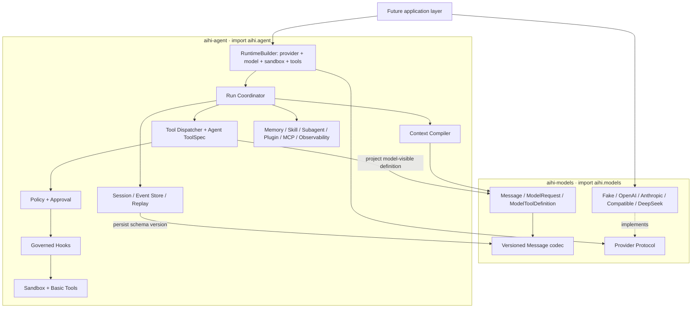

# AIHI 架构设计

状态：Accepted
版本：v0.4
日期：2026-08-11

本文件只描述**稳定契约**：不变式、边界和协议。里程碑顺序与完成进度属于
[TASK.md](TASK.md)，单次决策的取舍属于 `docs/adr/`。任何以「当前 Mx 提供…」开头的段落
都说明它写错了地方。

## 1. 定位与目标

AIHI 是面向多种 Agent 的可复用运行时基础设施。模型只负责生成意图，Harness 负责公共
运行时能力；具体 Agent 产品通过应用层组合 Harness。模型不是系统事实源，事件日志才是。

目标发布形态分为三个层次（ADR-0030）：

- `aihi-models` / `aihi.models`：最低层模型契约与 Provider Adapter；
- `aihi-agent` / `aihi.agent`：依赖 `aihi-models` 的完整、Provider-neutral Agent Runtime；
- 应用层（Coding、Cowork 等产品）：直接复用两个基础包，负责 Prompt、模型与 Provider 组合、
  工具集合、项目规则、交互和产品默认值。应用包位于 monorepo 的 `apps/`，基础包不得反向依赖它们。

Harness 不复制或内置某个产品 Agent；应用层也不得复制 Harness 实现。

AIHI 负责：

- 持久化会话、恢复、分支和审计；
- 上下文预算、自动压缩和大型输出管理；
- 模型协议、Provider 适配、错误归一化和成本记录；
- 工具注册、插件、MCP、Skill、Hook 和 Subagent；
- 策略决策、审批、能力租约和沙箱执行；
- 记忆、评估、事件回放和可观测性。

### 1.1 非目标

- 不在核心层绑定某个模型厂商或 Agent 编排框架；
- 不把完整历史覆盖成摘要；
- 不把第三方插件代码直接加载进 Harness 主进程；
- 不把 Host 执行描述成真正的安全隔离；
- 不在基础层构建 TUI、聊天渠道或控制台 —— 前端属于应用层；
- 不把 Coding、Cowork 或其他具体 Agent 的 Prompt、项目规则、角色编排和 CLI 交互写进
  基础层。

## 2. 总体拓扑



控制面决定执行计划和上下文；执行面承载有副作用的工具、Hook 和插件。所有副作用必须
经过 `tools → policy → hooks → sandbox` 链路。

应用层只负责组装，不建立第二套 Runtime。典型组合是：

```text
应用 config / Prompt / 项目规则 / TUI approval
  → aihi.models Provider / future application Gateway
  → aihi.agent ToolRegistry + Policy + Sandbox + RuntimeBuilder
  → aihi.agent RunCoordinator + Session/EventStore
```

应用从 `aihi.models` 取得模型契约和 Provider，从 `aihi.agent` 取得 Tool、Policy、Sandbox、
Runtime 和 `RuntimeExtensions`；是否注册 Edit/Shell/Test、选择哪个模型、如何展示 Approval 和
是否组合 Skill/Memory，由应用自行决定（见 §3.1 公共 API 边界）。

## 3. 工程目录

```text
packages/aihi/
  models/
    pyproject.toml       # distribution: aihi-models
    src/aihi/models/     # import: aihi.models
    tests/               # unit + provider contract
  agent/
    pyproject.toml       # distribution: aihi-agent; depends on aihi-models
    src/aihi/agent/
      _core/             # Private Event, Agent IDs/errors, schema/migrations
      runtime/           # Agent state machine, run coordinator
      sessions/          # Event store, snapshots, branching
      context/           # Context compiler and compaction
      tools/             # Tool contract, registry, dispatcher, basic tools
      plugins/ policy/ hooks/ sandbox/
      memory/ skills/ agents/ artifacts/ observability/ evals/ mcp/
    tests/               # unit + contract + integration + security
  code-agent/
    pyproject.toml       # distribution: aihi-code-agent; Coding runtime/Worker
    src/aihi/code_agent/
  code-protocol/
    src/                  # language-neutral Worker RPC DTOs and schemas
apps/
  aihi-code-cli/         # TypeScript Ink TUI; communicates with the Worker over stdio RPC
tests/
  integration/           # Tests against installed wheels
  packaging/             # Wheel layout, PEP 420, py.typed
  fixtures/              # Frozen events, legacy SQLite and traces
docs/
  rfcs/
  adr/
```

`src/aihi/` 是 PEP 420 namespace 根，不包含 `__init__.py` 或根级 `py.typed`；基础包各自
维护 `__init__.py`、`__all__` 和 `py.typed`。应用目录（Coding、Cowork 等产品：Prompt、Provider
组合、工具选择、TUI 前端、审批交互）可以复用基础包，但不进入基础包的 import 图。

依赖方向：`aihi.models ← aihi.agent ← application`；应用也可以直接组合 `aihi.models`。
`aihi.models` 不得 import `aihi.agent`，两个基础包不得反向 import 应用。`aihi.agent` 内部通过
Provider、Sandbox、Store、Plugin Host 等 Protocol 访问实现；应用组合层实例化具体实现并注入。
`aihi.agent.agents` 表示 Subagent 协调基础设施，不是用户可执行 Agent 的应用目录。

Runtime 通过 `RuntimeExtensions` 组合可选能力：`ContextContributor` 贡献只读上下文段落，
`RunRecorder` 观察已完成的 Run 并追加自己的审计事件。两者都是结构化 Protocol，能力包不 import
`runtime`，`runtime` 也不 import 能力包。当前已接线：Skill 索引、Memory 读取与候选抽取（ADR-0022）。Subagent 走另一条路径：
它是普通工具 `task`，因此派生子 Run 同样经过 `tools → policy → hooks → sandbox`；
子 Run 拥有独立 Session，权限模式取父子中更严格者（ADR-0023）。应用层 Coding runtime
已通过配置接线 MCP；Plugin 仍保持显式应用层接入边界。

### 3.1 Harness 与应用层边界

| 层 | 负责 | 不负责 |
|---|---|---|
| `aihi.models` | Model Message/Block、ModelRequest/Response、ModelToolDefinition、Provider Protocol、Adapter、模型消息 codec | Event、Agent ToolSpec、Policy、Sandbox、Router/Gateway、模型选择、凭据来源 |
| `aihi.agent` | Runtime、Event/Session、Context、`tools.ToolSpec`/Tool、Policy、Sandbox、Memory、Skill、Subagent、Eval、Observability | 具体 Provider、产品 Prompt、模型角色、产品默认工具集、终端 UI |
| 应用层（Coding、Cowork 等） | Agent 组装、Provider/Gateway、模型与工具选择、项目上下文、Approval UX、Memory/Subagent 工作流、TUI | 复制 Runtime、Provider Adapter、Policy、Sandbox 或 Event Store 实现 |
| 应用之间 | 各自 Agent 的 Prompt、角色、工具组合、交互和产品策略 | 直接修改另一个 Agent，或绕过 Harness 的工具/策略/沙箱链路 |

基础实现可以直接复用，不需要搬移或复制：应用直接实例化已有 Provider，创建
`ToolRegistry`，注册已有工具，注入 `DefaultPolicyEngine` 和 `HostBackend`，再构造
`RunCoordinator`。只有跨应用可复用的缺口才进入 Harness H-* Backlog；应用专属逻辑留在应用目录。

#### 组合：policy 归应用，plumbing 归 Harness

`aihi.agent.RuntimeBuilder` 承担通用装配，判据是一句可执行的问句：**每个合理的应用是否都会做同样的选择，
且做错了会不会无声？** 是则归 Harness，应用之间会合理地不同则归应用。

- **应用决定（必填，无默认）**：`provider`、`model`、`sandbox`、`tools`；Subagent 的 `authority`
  与模型；系统提示词与项目规则。空工具集会被拒绝 —— 替调用方挑工具就是把产品决策塞进库里。
- **Harness 装配（可选开启，有默认）**：从路径构造 Artifact Store 与 Telemetry sink、
  构造 Hook Bus、接线子代理的 runner 与
  session factory、把 Skill/Memory 适配器组装进 `RuntimeExtensions`。

基础包不提供 Router、Gateway 或 ModelRoles。未来应用层 Gateway 只能作为满足同一 `Provider`
Protocol 的 decorator 注入，不能控制 Run 恢复或工具重放。

**没有 `default_runtime()`**：任何替调用方选择 Provider 或工具集的便利函数，
都会重蹈已删除 CLI 的覆辙。安全相关的默认值（`ASK` 挂起、Host 显式 unsafe、
mutating hook 需 trust）仍由 Harness 决定 —— 那里的「灵活」等于让应用有机会无声地搞错。

#### 公共 API 边界

`aihi.models.__all__` 与 `aihi.agent.__all__` 是各自唯一受支持的跨 distribution 和应用组合面。
只能通过内部子模块访问的名字可以在没有公共兼容承诺的情况下变更。公共 API contract test 保证
导出集合可解析、有序，且导入不会拉入可选依赖。AST 边界测试必须禁止 `aihi.models →
aihi.agent`、禁止跨 distribution 内部 import，并在应用重建时禁止应用导入基础包内部模块。

公共能力的提升顺序不可颠倒：先有 Runtime 注入点，再写 ADR，最后才进入叶子公共 API
（`skills`、`memory` 见 ADR-0022，Subagent 见 ADR-0023）。

工具包内部还要区分契约层与执行层：`aihi.agent.tools.spec` 只依赖 `aihi.models`，供 Policy、
Context 和 Tool 执行层共同使用；`tools.base`、Registry、Dispatcher 位于其上。`tools` 包根对
Policy-aware Dispatcher 使用延迟导入，避免低层契约导入执行层形成循环。

### 3.2 Coding 本地进程协议

Python `aihi-code-agent` Worker 与 TypeScript `aihi-code-cli` 使用 Code Protocol 0.2：JSON-RPC
2.0 + `Content-Length` framing、exact-version initialize handshake。Run 请求只返回带必填
`run_id` 的接收确认；进度与终态由版本化 Event notification 给出，启动前失败由带
`session_id + run_id` 的 `run.error` 给出。共享 DTO、RPC method map、关键 runtime guards 与
JSON Schema 归 `packages/aihi/code-protocol`；Worker 是 Session/Event Store 的唯一写入端。
重连方必须通过 `session.events(after_seq)` 完整分页 replay 后再依赖实时通知，不能把首屏缓存或
TUI 内存当作事实源（ADR-0033、ADR-0034）。

Coding TUI 的 Transcript 是 Event Log 的应用层投影：历史 Event 与实时 durable notification
必须经过同一个纯 reducer；投影按 seq 去重，发现缺口时完整 replay。`model.chunk` 只维护临时
stream buffer，canonical `assistant.message` 到达后替换它。Tool Call、Tool 生命周期、Approval
与 Tool Result 通过稳定 ID 合并为同一展示项；Tool input 只允许显示显式白名单字段，不能把任意
输入复制进终端记录，白名单文本中的 credential pattern 仍须脱敏（ADR-0035）。

Transcript viewport 与 composer 是纯应用层状态：viewport 根据终端行列预算从完整投影选择可见行，
滚动只暂停自动跟随而不复制或修改 Transcript；Tool 结果折叠只影响展示。Composer 的多行草稿、
slash 补全与进程内历史不写 Event Store，只有提交后的用户消息由 Worker 成为事实（ADR-0036）。

## 4. Runtime 与 Agent Loop

一次用户请求对应一个 `Run`，一次会话可以有多个 Run。Runtime 是可恢复状态机：

```text
CREATED
  → RUNNING            (context compiled, model streaming, model completed)
  → WAITING_TOOL       (tool calls proposed, policy evaluated)
  → WAITING_APPROVAL   (policy returned ASK; suspended and resumable)
  → WAITING_TOOL       (approval granted or denied)
  → RUNNING
  → COMPLETED / FAILED / INTERRUPTED / CANCELLED
```

`WAITING_APPROVAL` 是唯一的非终态停机点：Run 追加 `run.suspended` 后返回，不写终态事件，
挂起的 Tool Call 保持未配对，由后续 `resume` 执行。恢复时追加 `run.resumed` 而不是第二个
`run.started`，因此恢复后的会话仍可 Replay。首次 `run.started` 同时固化模型、Provider、
Sandbox descriptor、Workspace Root、权限模式、Capability Lease 开关、System Prompt 摘要和输出
预算；Resume 从事件恢复这些值并拒绝任何漂移（ADR-0031）。

核心顺序不可交换：

1. 先追加 `assistant.message`，再执行模型提出的工具；
2. 每个 Tool Call 最终必须对应一个 Tool Result；
3. 工具结果和权限决定在执行后立即落盘；
4. 流式增量用于 UI，不作为每 Token 的持久事件：`ephemeral=True` 的事件只能经 `Session.emit`
   发布给 observer，`append` 会拒绝它们，反之亦然（ADR-0021）；
5. 取消或进程崩溃后，下一次 Resume 必须修复孤儿 Tool Call。

### 4.1 取消与恢复

打断与放弃是两个终态（ADR-0024）：`INTERRUPTED` 对应 `run.interrupted`，指 Run 执行中被
`cancel_event` 打断，可以 Resume；`CANCELLED` 对应 `run.cancelled`，指所有者显式放弃，
由 `RunCoordinator.abandon()` 写入，不可恢复。

取消流程必须收尾所有在飞任务，给未完成 Tool Call 合成错误结果，并追加
`run.interrupted`。进程直接退出时，Session Load 会扫描未配对调用并生成
`session.repaired`。不得自动重放未知是否已产生副作用的工具。挂起等待 Approval 的 Run
只能通过解决 Approval 或 `abandon()` 离开 `WAITING_APPROVAL`。

主动挂起与崩溃必须区分：等待 Approval 的 Tool Call 没有丢失执行状态，孤儿修复必须跳过
`run.suspended` 记录的 `pending_tool_call_ids`，由 Resume 真正执行它们。带外拒绝按
`run_id + tool_call_id` 关联原 Approval，在恢复时产生该 Tool Call 唯一的 `permission_denied`
结果，不得再次申请同一审批（ADR-0031）。

## 5. 核心契约

### 5.1 Canonical Types

模型协议类型由 `aihi.models` 定义：

- `Message`、`TextBlock`、`ThinkingBlock`、`ImageBlock`；
- `ToolCallBlock`、`ToolResultBlock`；
- `ModelRequest`、`ModelResponse`、`Usage`、`Capabilities`；
- `ModelToolDefinition`、Provider-neutral Stream Chunk。

Agent 运行时类型由 `aihi.agent` 定义，工具契约由 `aihi.agent.tools` 定义：

- `Event`、Run/Session ID 与 Agent Error；
- `ToolSpec`、`ToolContext`、`ToolExecutionResult`；
- Policy、Approval、Sandbox、Artifact、Memory 和 Subagent 类型。

`ToolSpec` 持有 `ModelToolDefinition` 以及 mutates、并发、能力、超时和幂等治理字段；编译
`ModelRequest` 时只投影模型可见定义。所有跨边界类型必须支持稳定 JSON 序列化和无损往返。
Provider 的签名、加密推理载荷等放在 `ThinkingBlock.opaque`，只由对应 Adapter 解释。

模型消息使用独立 `message_schema_version`。Agent Event 持久化模型消息时必须记录该版本；旧事件
缺少版本时按 Message Schema v1 读取。Message codec 与 Event Store 的跨 distribution 冻结语料
共同守住旧 Session 恢复，不能让模型类型演进绕过 Event migration（ADR-0030）。

### 5.2 Event

事件统一包含：

```text
event_id, session_id, run_id, seq, type, schema_version, created_at, data
```

事件是事实源；Projection、Snapshot、Trace 和 Eval 都从事件产生。

`schema_version` 版本化的是**信封**（每个事件共有的记录结构），不是单个事件类型的 payload。
兼容性规则（`aihi.agent._core` 的 schema 模块）：

- 新增事件类型、为 `data` 增加可选字段是加法变更，不需要升版本；读取方必须容忍未知类型；
- 删除/重命名字段或改变既有字段含义，必须升信封版本并同时注册迁移；
- 读取方遇到不认识的信封版本必须拒绝，而不是当作当前版本解析（`UnsupportedEventSchema`）。

事件类型分三类：`DURABLE_EVENT_TYPES`（写入且持久化，必须被冻结语料覆盖）、
`EPHEMERAL_EVENT_TYPES`（只经 `Session.emit` 给 observer，无兼容性义务）、
`LEGACY_EVENT_TYPES`（投影仍能读，但已无写入方）。
Event compatibility contract test 用一份冻结的 v1 会话语料同时守住三件事：
语料覆盖全部 durable 类型、源码中出现的字面量事件类型都在目录内、旧会话的投影与回放结果不漂移。
此外必须用真实旧 SQLite fixture 和 TraceBundle 验证安装后的两个新 wheel 能完整 reload/replay；
不得重新生成旧 fixture 来适配新实现。

推荐事件类型：

```text
session.created / session.forked / session.repaired
run.started / run.resumed / run.suspended
run.completed / run.failed / run.interrupted / run.cancelled
user.message / assistant.message / tool.result
model.requested / model.completed / usage.recorded
tool.requested / tool.started / tool.completed
policy.decided / approval.requested / approval.resolved / approval.consumed
capability.lease.issued / capability.lease.revoked
context.compaction_started / context.compacted
compaction.created (trigger: budget | preflight_context_window | provider_context_length)
artifact.created / artifact.deleted
memory.candidate / memory.written
subagent.started / subagent.completed
```

## 6. 会话与存储

`sessions` 保存元数据和 `head_seq`；`events` 按 `(session_id, seq)` 追加。追加必须携带
`expected_seq`，冲突时拒绝写入。**单会话只能有一个写者** —— 这条不变式支撑了 Subagent 使用
独立 Session 的设计（ADR-0023）。

- SQLite WAL：单文件、事务、可备份；
- 其他后端遵循同一个 `EventStore` Protocol；
- 大型输出、Diff、附件和日志：Artifact Store；
- Snapshot：按事件数量或时间生成，只用于加速 Load，不取代事件。

Branch 通过 `Session.fork(at_seq=...)` 表达：父会话不被写入，子会话复制该前缀成为一个**普通
会话** —— 序号从 1 连续、单写者、可独立回放。复制体是新记录（事件 id 全局唯一），但保留原
`run_id` 与 `created_at`，因为「何时发生」是事实。分支关系同时写入子会话元数据
（`parent_session_id`/`forked_at_seq`）和 `session.forked` 事件。
在未完成的 Tool Call 中间 fork 是允许的，子会话会带一个孤儿调用，由下一次 Run 按既有的
丢失执行状态流程修复。

## 7. 上下文与自动压缩

Context Compiler 将系统指令、可选的扩展段落（Skill 索引、记忆等）、历史消息、工具 Schema 和
当前用户输入编译成模型请求，并在编译前计算预算。扩展段落由 `RuntimeExtensions.context_contributors`
以已渲染的 `ContextSection` 形式提供，因此 `context` 包不依赖 `skills`/`memory`（ADR-0022）；
段落计入预算，contributor 抛错时 Run fail closed，不静默丢弃上下文：

```text
usable_input = context_window - reserved_output - tool_schema - safety_margin
```

压缩按成本递增：

1. 输出外置：大工具结果写入 Artifact，仅保留预览和引用；
2. 确定性微压缩：清理旧工具结果和重复上下文；
3. 语义压缩：通过 **async** `SummaryGenerator` 协议生成结构化摘要。默认是无网络的
   `DeterministicSummaryGenerator`；`ModelSummaryGenerator` 显式接收 compact `provider + model`，
   输入发送前截断，回复必须落回同一 schema，任何故障都降级而非让 Run 失败
   —— 压缩失败等于 `ContextWindowExceeded`（ADR-0029）。

结构化摘要至少保留目标、约束、决策、文件变化、验证结果、未解决事项、下一步、
权限模式、Skill、Subagent 和 Artifact 引用。压缩记录源事件范围、摘要策略、Prompt Hash、
前后 Token 估算、摘要版本和触发原因。`strategy` 取自摘要本身
（`l1_deterministic` / `l2_deterministic` / `l2_model` / `l2_model_fallback`），
因此降级在事件日志里可见。Provider 返回 Context Length 错误时，每个 Run 最多
执行一次响应式 L2 压缩；第二次错误直接失败。压缩不得切断 Tool Call/Tool Result 配对。

Artifact Store 使用不可变内容摘要校验 Payload，并在 Manifest 中记录 `ArtifactPolicy`：
`run`、`session` 或 `persistent` Retention，以及可选过期时间。Runtime 产生的上下文 Artifact
默认绑定当前 Session；读取、删除和过期清理由带有匹配 `ArtifactAccess` 的调用执行。相同内容
在不同 Session/Run 的作用域下使用不同 Artifact ID，避免内容寻址去重跨越权限边界。
`expires_at` 是硬过期边界：过期条目立即拒绝读取并从普通列表隐藏，清理器只负责物理回收。
Runtime 的删除和过期清理入口追加 `artifact.deleted`，原始 `artifact.created` 事件不覆盖；
Store 的 `delete` 仅是受控物理存储原语，不绕过 Runtime 审计。

## 8. Models：模型契约与 Provider Adapter

`aihi.models.Provider` 是基础 Runtime 唯一依赖的模型边界。Provider Adapter 实现：

```text
capabilities(model)
stream(ModelRequest)
count_tokens(ModelRequest)
```

Capability 包含 Streaming、Tool Calling、Parallel Tools、Reasoning、Vision、Prompt Cache、
Token Counting、Context Window、Max Output 和 Effort Levels。

基础包不提供 `ModelRouter`、`ModelGateway` 或 `ModelRoles`。`RuntimeBuilder` 显式要求主
`provider + model`；模型压缩与 Subagent 也显式接收各自的 `provider + model`。第一阶段因此
没有跨 Provider routing/fallback。未来应用层可以实现满足同一 Provider Protocol 的 Gateway
decorator，但不得控制 Run 恢复或 Tool 重放。

Provider stream 只能产生一个终态；产生首个 Chunk 后不得自动 retry 或切换 Provider；Provider
自身不得执行工具。错误必须包含稳定错误码和 `retryable` 属性，由应用层在尚无输出时决定是否
重试或切换。凭据来源、默认模型、路由、截止时间和 fallback 顺序同样属于应用决策。
通用 `OpenAICompatibleProvider` 必须显式接收完整 Chat Completions endpoint，禁止继承 OpenAI
默认 endpoint；厂商专用的固定 endpoint 只存在于对应 Adapter 内（ADR-0031）。

## 9. Tools、Plugins、Skills 与 Hooks

### 9.1 Tools

每个 Agent Tool 通过 `aihi.agent.tools.ToolSpec` 声明模型定义、是否修改外部状态、并发安全、能力
需求、超时和幂等策略；其中 `aihi.models.ModelToolDefinition` 只包含名称、描述和 JSON Schema。
所有输入先校验和规范化，再进入 Policy。Provider 不接收或解释 Agent 治理元数据。

内建工具按授权分三类，名字与语义一致（ADR-0028）：只读的 `read_file`/`glob`/`grep`
（免审批、可并行）、写入的 `write_file`/`edit_file`（`accept_edits` 覆盖）、执行的 `bash`
（声明 `process.exec`，永远逐次审批）。`bash` 接收命令字符串并显式 exec bash，
`SandboxBackend.run_command(argv)` 契约不变，任何地方都不使用 `shell=True`。

同一条 Assistant 消息里连续的**只读且并发安全**工具调用会并行执行；`mutates=True`、
未声明 `concurrency_safe` 或未注册的工具一律单独执行，保证可观察的顺序。无论是否并行，
Tool Result 都按调用顺序提交；并行组中若有调用需要 Approval，已完成的结果照常落盘，
该调用及其后的调用保持挂起。

### 9.2 Plugins

Plugin 使用 `plugin.json` 描述 Manifest Version、ID、SemVer、Harness API 约束、能力、权限、
Entry Point 和可选内容 Hash。Discovery 只读取 Manifest 并对 Manifest 之外的文件做确定性
Hash，不 import 或执行第三方代码。第三方插件由独立 Plugin Host 子进程加载，通过 JSON-RPC
或等价协议通信。项目级插件默认关闭；启用前必须对精确的
`plugin_id@version+manifest_sha256+content_sha256` 记录显式 Trust，并写入原子更新的
lockfile；Manifest 或内容 Hash 变化后自动失效。
真正激活前必须重新 Discovery/Hash 校验候选快照，防止 Trust 记录和 Host 启动之间的 TOCTOU。

Host 激活还必须通过显式 `PluginHostPolicy`：Manifest 的 `capabilities` 和 `permissions` 必须
分别是当前 Run 允许集合的子集，否则拒绝启动。Host 使用最小环境、无 Shell 的独立进程组和
有界 JSON-lines JSON-RPC（`aihi.plugin.v1`）；超时、协议错误、崩溃都会终止整个进程组。
主进程只持有 `PluginRemoteTool`，Tool 调用仍由 `ToolDispatcher` 统一执行；Plugin Host 不得
直接授予 Policy、Approval、Capability Lease 或 Sandbox 权限。

### 9.3 Skills

兼容 `SKILL.md` + 严格 frontmatter。frontmatter 当前只允许 `name`、`description`、
`version`、`allowed_tools`、`required_permissions` 和 `tags`；不支持脚本入口或可执行指令。
Skill 按 `builtin < user < project < workspace` 分层发现，高层同名 Skill 遮蔽低层版本，
同层重复则拒绝启动。Discovery 只保留索引元数据和内容 Hash，不把 Markdown 正文放入候选对象。

启动或编译上下文时只注入 Skill 索引（名称、描述、版本和作用域），且仅在同一 Runtime 确实
注册了 `load_skill` 时注入。正文必须由调用方显式请求；索引中的精确 `name@version` 可以直接
传给 loader，裸 `name` 作为兼容输入保留。应用随包注入的 `BUILTIN` Skill 以包完整性作为隐式
Trust，配置根不能声明该作用域；其他作用域必须经过精确的
`name@version+scope+content_sha256` Trust、重新 Discovery/Hash 校验后才能加载。未请求、未信任、
已禁用的非内置 Skill 一律拒绝；所有 Skill 未请求或发生变更时也一律拒绝。Skill 内容只能
作为当前 Run 的知识输入，不能扩大
工具、Policy、Approval、Capability Lease 或 Sandbox 权限。

### 9.4 Hooks

生命周期包括 `RunStart`、`BeforeModel`、`AfterModel`、`BeforeTool`、`AfterTool`、
`PolicyDecision`、`BeforeCompact`、`AfterCompact`、`Subagent*` 和 `RunStop`。
Hook 注册必须声明来源、稳定 ID、优先级、超时、失败策略和只读/可修改属性；执行顺序为
`priority` 升序、注册序号升序。每个 Hook 都收到独立的不可变事件快照，超时会取消在飞任务。
失败策略只有 `fail_fast` 和 `continue`，结果包含逐 Hook 的成功、耗时和错误码。

有副作用的 Hook 必须显式 Trust，并且只能在调用方提供的 `HookGovernance` 中执行；治理证据
至少包含已通过 Policy 的决定和 Sandbox 描述，可选绑定 Approval 与 Capability Lease。Hook
不能自行创建治理证据、修改事件输入或绕过 `tools → policy → hooks → sandbox` 链路。

### 9.5 MCP

MCP Client/Server 使用 JSON-RPC 2.0 边界，方法集为 `initialize`、`tools/list`、
`tools/call` 和初始化通知；传输通过 `McpTransport` Protocol 注入，内置内存传输仅用于契约测试，
不把网络或第三方 MCP SDK 引入 Core。Server Tool Schema 必须是对象 JSON Schema，并将
`readOnlyHint`、`destructiveHint`、`idempotentHint`、`openWorldHint` 映射到
`aihi.agent.tools.ToolSpec` 的执行治理字段；暴露给模型的部分再投影成 `ModelToolDefinition`。

MCP 远程工具通过 `register_mcp_tools()` 注册到 `ToolRegistry`（Plugin 对应
`register_plugin_tools()`），因此调用统一经过
`tools → policy → hooks → sandbox` 链路；直接 `McpClient.call_tool` 是低层传输 API，不得作为
Runtime 的模型工具入口。缺少明确 `readOnlyHint=true` 的远程工具按可变更工具处理。
注册时可用 `allowed_tools` 按服务端工具名过滤，应用因此不必信任服务器自我约束。
MCP 原始工具名可以包含点号且长度上限高于多数模型 API；注册时会生成确定性的、最多 64 个字符且
仅含 `[A-Za-z0-9_-]` 的模型可见别名（例如 `mcp__memory__search`）。模型返回别名后仍由同一个
适配器调用原始 MCP 名称，别名冲突通过短哈希消解。
`StdioMcpTransport` 是标准 stdio 传输：无 shell、独立进程组、最小环境、消息上限和有界关闭
（ADR-0026）。

断线重连最多按配置次数执行；只读工具可以重试，可能产生副作用的工具绝不自动重放，避免远端
已经执行成功但响应丢失时造成重复副作用。连接、协议、远端错误统一映射为稳定 MCP 错误类型。

## 10. Policy 与 Sandbox

Policy 输出 `ALLOW / DENY / ASK`，同时返回原因、命中的规则、作用域和有效期。硬拒绝优先于
组织、工作区、用户和会话临时授权。路径要 canonicalize，并检查 symlink escape。

命令内容的敏感路径检查是**启发式而非安全边界**：它拦得住 `cat ~/.ssh/id_rsa`，拦不住引号
拼接。命令类工具的真实边界是「每次执行都需要显式审批」加上沙箱约束（ADR-0028）。

`mutates` 与「执行进程」是两条独立的授权轴。声明 `process.exec` 能力的工具一律需要显式
Approval：`accept_edits` 只覆盖工作区编辑，`plan` 同时拒绝两者，只有人的显式 Approval
能授权执行。放行分支的 `rule_id` 必须如实反映依据（`mode.accept_edits`、`approval.granted`、
`default.read_only`），审批率和拒绝率指标直接由这些事件派生。

Policy 返回 `ASK` 时 Runtime 必须挂起而不是伪造 Tool Result：追加 `approval.requested`、
进入 `WAITING_APPROVAL`，并把决定交给注入的 `ApprovalResolver`
（`GRANTED / DENIED / DEFERRED`）。未注入时默认 `DEFERRED`，即 Run 挂起等待带外解决，
既不自动批准也不自动拒绝。Resolver 属于应用层（终端交互、带外解决），Harness 只定义契约。
批准 `capability.lease_required` 会签发一张 run-scoped Capability Lease。

Approval 与 Capability Lease 都是 append-only 授权事件的投影，并绑定单个 `run_id`。
两者在过期或撤销后失效；Runtime 在每次工具调用前从 Session 事件重建有效授权，不能把
未持久化的内存授权当作事实源。Approval 的请求和解决结果分别记录，只有匹配 pending
请求的单次 granted 结果才会产生有效授权；默认 ASK 会追加 `approval.requested`。

授权有两种生命周期（ADR-0025）：`GRANTED` 在本 Run 内对该工具持续有效；`GRANTED_ONCE`
只授权一次调用，被使用后追加 `approval.consumed` 并从投影中移除，下一次调用重新询问。
只有一次性授权可以被消费，重复消费和消费 Run 级授权都会让投影 fail closed。

### 10.1 已确认的沙箱基线

- `HostBackend` 是本地首选，适合最小依赖和快速启动；
- Host 执行必须显式 `unsafe=true`，未显式声明时拒绝；
- 每个 `run.started`、`tool.started` 事件记录 `sandbox=host, unsafe=true`；
- Host 仅提供工作区路径约束、超时、输出上限和进程组清理，不宣称系统隔离；
- `LocalIsolatedBackend` 是可选的 OS-native 本地后端：Linux 使用 bubblewrap namespace，macOS
  使用 Seatbelt；它必须在 launcher 能力探测成功后才构造，默认隔离网络、进程并限制 workspace
  外写。`filesystem_write_isolated`、`network_isolated`、`process_isolated` 和 mechanism 都写入
  `SandboxDescriptor`；本地后端仍可能读取主机只读文件，不能把它描述成完整的文件机密边界；
- `DockerBackend` 是可选后端，要求真实隔离的部署通过策略禁止 Host；
- 本地 launcher 不可用或能力不足时必须 fail closed，禁止静默降级为 Host；要求完整文件系统
  隔离的 Policy Profile 只能选择具备 `filesystem_isolated=true` 的后端（通常是 Docker）；
- 后续可加入 gVisor、Firecracker 或 Kubernetes Worker。

Docker 参数必须以 argv 形式构造，默认 `--network none`、只读容器根、`no-new-privileges`、
丢弃 capabilities、PID/内存/CPU 上限和独立 `/tmp`；workspace 作为唯一显式 bind mount，事件
记录 image、network 和 mount 作用域。Docker CLI/Daemon 不可用时构造或执行失败，不回退到 Host。
Worktree 只表达子任务的 `task_id`、base commit、canonical root 和 allowed paths；PatchArtifact
只引用外置 diff Artifact、base commit、变更路径和 SHA-256。应用 Patch 前必须通过
`WorktreePatchBoundary` 校验任务归属、base commit、`.git` 禁止路径和 allowed paths；本步不自动
创建 Git Worktree、不自动合并 Patch。

执行链：

```text
Schema Validate
→ Canonicalize
→ Policy Preflight
→ BeforeTool Hook
→ Policy Re-evaluate
→ Approval
→ Capability Lease
→ Sandbox Execute
→ AfterTool Hook
→ Persist Result
```

## 11. Memory 与 Agents

Memory 分为 Working、Episodic、Semantic、Procedural 四层。长期记忆必须带作用域、来源、
置信度、时间和可删除标记；写入前做 Secret/PII 清洗、去重和人工可追溯。候选抽取与持久写入
分离：只有显式 `memory.written` 才进入 Durable Store，`memory.candidate` 仅记录待确认提案。
提取器是确定性的显式抽取，检索为词法检索，删除为 tombstone。Memory
写入必须带匹配的 `MemoryAccess`，并由 Store 端再次清洗和深拷贝；原始内容不得绕过清洗器
进入长期记忆。Memory 事件由调用方追加到 Session Event Store。
`MemoryService` 默认要求可用的审计事件 Sink；只有明确设置 `audit_required=false` 的离线工具
才允许 best-effort 写入。

Subagent 是父 Run 下的独立 Task/Run 节点，权限只能是父节点的子集，拥有独立预算、上下文、
工作区或 Git Worktree。可快照的 `TaskGraph` 管理 `PENDING → RUNNING → WAITING →
COMPLETED/FAILED/CANCELLED/INTERRUPTED` 状态，并通过结构化 `TaskSpec`、有界 FIFO `Mailbox`
和 `TaskResult` 协作。子任务的 capability、Token/成本/超时/Tool Call 预算、只读工作区和最大
深度在创建时校验，不能由子代理自行扩大；Mailbox 的发送者和接收者必须属于同一图，消息先进入
in-flight 状态，消费方显式 ack 后才删除。取消会递归收尾活动后代，Interrupted 只能显式 Resume，
图和 Mailbox 快照可用于进程重启恢复。子代理在本进程内以子 Run 执行（见下）；分布式 Worker
与 Docker 隔离是可选部署适配，任何此类 Worker 都必须从这些持久化边界恢复，不能把本地线程
状态当作事实源。

子代理的执行入口是工具 `task`（`required_capabilities=("agent.spawn",)`、`mutates=True`），
因此 Plan 模式直接拒绝派生，默认模式需要 Approval。子 Run 在**独立 Session** 中执行以保持单写者
不变式，两侧日志通过子 Session metadata 和父侧 Tool Result metadata 关联；`subagent.started` /
`subagent.completed` 写入子 Session。预算真实生效：超时用 `wait_for`，Tool Call 上限由子 Session
的事件 observer 触发取消。未显式指定时，子代理继承父能力集合减去 `agent.spawn`（ADR-0023）。
子 Run 的 Coordinator 只接收按 `WorkspaceScope` 收窄的 Sandbox View；它强制 canonical root、
allowed paths 和 read-only。底层 backend 无法可靠表达收窄范围时，进程执行 fail closed，不能仅靠
`TaskGraph` 的声明校验（ADR-0031）。

## 12. Eval 与 Observability

本节描述稳定契约。各里程碑的交付顺序与当前进度见 [TASK.md](TASK.md)，具体决策见对应 ADR。

### 12.1 Trace 与 Observation

每个 Session、Run、Model Attempt、Tool Call、Policy Decision、Hook、Sandbox 和 Compaction
都带 Trace Context。canonical 类型是 `TraceContext`、`Observation`、`MetricPoint`、`CostRecord`
和 `TelemetrySink` Protocol，均不绑定厂商。

- `Telemetry` 通过 Session 的已持久化 Event observer **旁路**记录，不改变事件顺序、Policy 或
  Sandbox 决策；observer 收到深拷贝，观测异常 fail-open；
- `ephemeral=True` 的事件不进入观测记录，否则有界 sink 会被 token delta 挤爆（ADR-0021）；
- `RunCoordinator` 在 Run 的每个出口（完成、失败、打断、放弃、挂起）flush 一次；flush 失败只是
  观测侧失败，不改变已持久化的 Run 结果。共享 sink 不在单个 Run 中关闭，进程退出时由宿主调用
  `Telemetry.close()`；
- 自定义 Sink 必须是有界、非阻塞实现。

### 12.2 脱敏与成本

Redactor 对 Secret-looking key、Bearer/API token、非有限数字、超长内容和未知对象 **fail-closed**。
成本按 Usage 与每千 Token 价格确定性计算，拒绝负数、非有限和溢出结果。任何 exporter 都必须在
边界再次脱敏，并保留 canonical `unit`。

### 12.3 Exporter 与远程管线

核心不强制安装 OpenTelemetry；缺少 OTel API 或数值溢出时 fail closed。

`OtelBatchPipeline` 把再次脱敏后的 `Observation` 放入有界队列，背压策略必须显式选择
`raise`、`drop_newest` 或 `drop_oldest`；批量传输只对标记 retryable 的错误做有限指数退避，
重试耗尽以稳定错误码结束并记录丢弃数，**不能阻塞 Event Store**。`W3CTracePropagator` 严格校验
`traceparent`；Bearer token 只存在于发送时的 Authorization header，不进入 Observation、resource
或错误详情。Runtime 不自动打开远程网络出口，HTTP client 可注入以便离线契约测试。

### 12.4 Replay 与 Eval

`TraceBundle` 只接受显式 `redacted=true` 的**单 Session** 事件，构造时递归冻结、按 canonical
Redactor 规范化，并对完整规范化 JSON 计算 SHA-256；Hash、Schema、序列号或 Session 不一致即拒绝。

委派到子代理的运行跨越两个会话，因此 `TraceGraph` 把多个单会话 Bundle 组合起来并**校验**它们
之间的链接（父会话归属、父 Run 存在、任务不重复、委派必须有结果），`replay_graph()` 输出统一的
`Delegation` 结构；`TraceBundle` 本身仍是单会话的（ADR-0027）。`subagent.started` /
`subagent.completed` 是会话级记录，`run_id=None`、子 Run id 放在 payload，因为它们描述某个
子 Run 而不属于它。

`ReplayEngine` 只投影 Run/Tool/Message 状态，**绝不**调用 Provider、Tool、Plugin 或 Sandbox；
拒绝跨 Run 的工具生命周期、重复终态和 Ephemeral 事件，但允许 Policy 拒绝后仍持久化对应 Tool
Result。带 `run_id` 的事件分两类：**推进 Run 的执行事件**不得出现在终态之后；
**引用 Run 的记账事件**（Lease 撤销、Artifact 删除、Memory 与 Subagent 记录）可以，
因为清理和记录本就发生在 Run 结束之后。`Grader` 只消费 `ReplayResult`，分数必须是有限的 `[0,1]` JSON 数值。

离线 Provider 评估同理：`ProviderGoldenRunner` 只消费 Provider-neutral stream chunks，消息 ID
和工具调用 ID 不进入可审计 fixture，request fingerprint 由脱敏 canonical request 计算；Provider
异常降为稳定 error code，不重试也不重放任何副作用。`EvalGate` 输出严格 JSON `GateVerdict`，
空数据、阈值不足和失败 case 都可在 CI 中阻断。

### 12.5 Worker 关联

Worker 相关的 Trace 结构只用于**可观测性关联**，不承载授权：

- `WorkerTraceManager` 用父 Run 的 TraceContext 为每次 Worker attempt 创建 child span；跨进程
  恢复时严格解析传入的 `traceparent` 并重新生成 span ID，没有 parent carrier 时 fail closed；
- `WorkerLeaseEnvelope` 只携带 lease identity、expiry、fencing token、attempt 和 `traceparent`；
  它是可序列化关联数据，**不是授权凭据**。取得/续租/释放仍走 fenced store，takeover 后旧 fencing
  token 依然无法续租或释放；
- Worker IPC 使用 canonical JSON + HMAC-SHA256 detached signature 并支持 key-id 轮换；
  mTLS/TLS 由宿主 transport 终止和校验，API 路由默认不存在；
- 这些结构都不改变 TaskGraph 的权限、预算、Lease、Policy 或 Sandbox。

### 12.6 指标

评估支持 Fake/Replay、Provider Contract、Golden Tasks、安全测试和 Coding Tasks。核心指标：

- 任务成功率、测试通过率和 Patch 正确率；
- 恢复成功率、孤儿 Tool Call 率；
- 压缩前后 Token、上下文保持率；
- Tool 错误率、策略拒绝率、审批率；
- 首 Token 延迟、总延迟、Token 和成本。

## 13. 技术与形态

Python 3.11+、asyncio、SQLite。`aihi-models` 使用 `httpx` 完成 Provider 适配；
`aihi-agent` 只依赖其公共模型契约，不依赖厂商 SDK。两个基础包都不依赖 LangChain/LangGraph，
保持对 Provider 和执行面的控制。

目标形态是两个可独立安装、可共同组合的**可嵌入库**：`aihi-models` 与 `aihi-agent`。它们不提供
产品 CLI、HTTP 控制面或后台服务。命令行、交互方式、Gateway 和产品默认值属于未来应用层
（见 §3.1、ADR-0030）。迁移完成记录与后续任务见 [TASK.md](TASK.md)。

平台类能力（下表）**已重新纳入范围**，但尚无实现代码。它们只能以适配器形式接入既有协议，
不得改变 Runtime 的契约或安全默认值；范围与优先级见 [TASK.md](TASK.md#范围与方向)。

| 平台能力 | 接入点（已存在的协议） |
|---|---|
| HTTP 控制面 / 服务化 | 公共 API + `EventStore` 投影；带外 Approval 走既有 Approval 事件 |
| 多 Worker、Run lease、fencing | `EventStore`（`expected_seq` 已是并发写入的必要条件） |
| PostgreSQL Store | `EventStore` |
| 远程 OTel 管线 | `TelemetrySink` |

不变的是这一条：新增适配器，不是重写运行时。任何要求修改 `RunCoordinator` 契约才能落地的
「平台能力」，都说明它的设计走错了方向。
