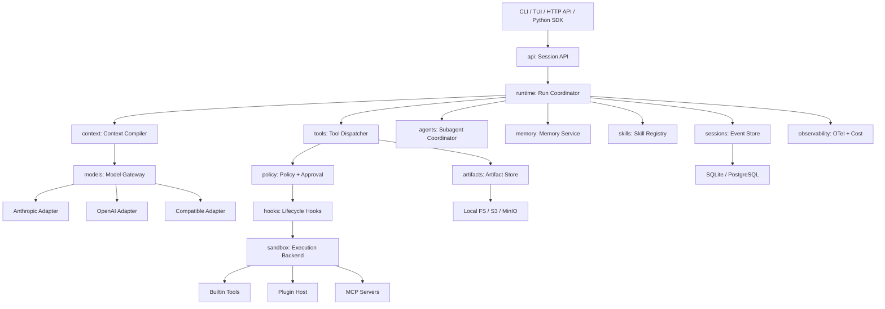

# AIHarness 架构设计

状态：Accepted / 实施中
版本：v0.1
日期：2026-08-04

## 1. 定位与目标

AIHarness 是面向 Coding Agent 的运行时基础设施。模型只负责生成意图，Harness 负责：

- 持久化会话、恢复、分支和审计；
- 上下文预算、自动压缩和大型输出管理；
- Provider 适配、多模型路由和成本控制；
- 工具注册、插件、MCP、Skill、Hook 和 Subagent；
- 策略决策、审批、能力租约和沙箱执行；
- 记忆、评估、事件回放和可观测性。

### 1.1 非目标

- 不在核心层绑定某个模型厂商或 Agent 编排框架；
- 不把完整历史覆盖成摘要；
- 不把第三方插件代码直接加载进 Harness 主进程；
- 不把 Host 执行描述成真正的安全隔离；
- 不在第一阶段构建复杂 TUI、聊天渠道或控制台。

## 2. 总体拓扑



控制面决定执行计划和上下文；执行面承载有副作用的工具、Hook 和插件。所有副作用必须
经过 `tools → policy → hooks → sandbox` 链路。

## 3. 工程目录

```text
src/aiharness/
  core/                 # Canonical types, events, IDs, errors
  runtime/              # Agent state machine, run coordinator
  sessions/             # Event store, snapshots, branching
  context/              # Context compiler and compaction strategies
  models/               # Gateway, router, provider adapters
  tools/                # Tool contract, registry, dispatcher
  plugins/              # Manifest, discovery, plugin host
  policy/               # Rules, decisions, approvals, capability leases
  hooks/                # Lifecycle event bus
  sandbox/              # Backend protocols and implementations
  memory/               # Extraction, retrieval, scopes
  skills/               # SKILL.md discovery and loading
  agents/               # Subagent task graph and coordination
  artifacts/            # Large output and patch storage
  observability/        # OTel, logging, cost accounting
  evals/                # Datasets, replay, graders
  api/                  # FastAPI optional service
  cli/                  # Typer CLI
tests/
  unit/
  contract/
  integration/
  security/
  evals/
docs/
  rfcs/
  adr/
plugins/
examples/
```

依赖方向：`core` 不依赖其他业务包；领域包依赖 `core`；`runtime` 组装依赖；`api/cli`
只调用公共 Runtime API。Provider、Sandbox、Store 和 Plugin Host 只能通过协议访问。

## 4. Runtime 与 Agent Loop

一次用户请求对应一个 `Run`，一次会话可以有多个 Run。Runtime 是可恢复状态机：

```text
ACCEPTED
  → CONTEXT_COMPILED
  → MODEL_STREAMING
  → MODEL_COMPLETED
  → TOOL_CALLS_PROPOSED
  → POLICY_EVALUATED
  → APPROVAL_PENDING / TOOL_EXECUTING
  → TOOL_RESULTS_COMMITTED
  → CONTEXT_COMPILED
  → COMPLETED / FAILED / CANCELLED / INTERRUPTED
```

核心顺序不可交换：

1. 先追加 `assistant.message`，再执行模型提出的工具；
2. 每个 Tool Call 最终必须对应一个 Tool Result；
3. 工具结果和权限决定在执行后立即落盘；
4. 流式增量用于 UI，不作为每 Token 的持久事件；
5. 取消或进程崩溃后，下一次 Resume 必须修复孤儿 Tool Call。

### 4.1 取消与恢复

取消流程必须收尾所有在飞任务，给未完成 Tool Call 合成错误结果，并追加
`run.interrupted`。进程直接退出时，Session Load 会扫描未配对调用并生成
`session.repaired`。不得自动重放未知是否已产生副作用的工具。

## 5. 核心契约

### 5.1 Canonical Types

`core` 只定义厂商无关类型：

- `Message`、`TextBlock`、`ThinkingBlock`、`ImageBlock`；
- `ToolCallBlock`、`ToolResultBlock`；
- `ModelRequest`、`ModelResponse`、`Usage`、`Capabilities`；
- `ToolSpec`、`ToolResult`、`Event`。

所有类型必须支持稳定 JSON 序列化和无损往返。Provider 的签名、加密推理载荷等放在
`ThinkingBlock.opaque`，只由对应 Adapter 解释。

### 5.2 Event

事件统一包含：

```text
event_id, session_id, run_id, seq, type, schema_version, created_at, data
```

事件是事实源；Projection、Snapshot、Trace 和 Eval 都从事件产生。

推荐事件类型：

```text
session.created / session.forked / session.repaired
run.started / run.completed / run.failed / run.interrupted
user.message / assistant.message / tool.result
model.requested / model.completed / usage.recorded
tool.requested / tool.started / tool.completed
policy.decided / approval.requested / approval.resolved
capability.lease.issued / capability.lease.revoked
context.compaction_started / context.compacted
compaction.created (trigger: budget | preflight_context_window | provider_context_length)
artifact.created
memory.candidate / memory.written
subagent.started / subagent.completed
```

## 6. 会话与存储

`sessions` 保存元数据和 `head_seq`；`events` 按 `(session_id, seq)` 追加。追加必须携带
`expected_seq`，冲突时拒绝写入。单会话由一个 Runtime Owner 写入，生产 Worker 通过 lease
保证所有权。

- 本地：SQLite WAL，单文件、事务、可备份；
- 生产：PostgreSQL，使用同一 Store Protocol；
- 大型输出、Diff、附件和日志：Artifact Store；
- Snapshot：按事件数量或时间生成，只用于加速 Load，不取代事件。

Branch 通过父 Session + 起始序号表达；父会话不可变，子会话只追加自己的事件。

## 7. 上下文与自动压缩

Context Compiler 将系统指令、项目约定、Skill 摘要、记忆、历史消息、工具 Schema 和
当前用户输入编译成模型请求，并在编译前计算预算：

```text
usable_input = context_window - reserved_output - tool_schema - safety_margin
```

压缩按成本递增：

1. 输出外置：大工具结果写入 Artifact，仅保留预览和引用；
2. 确定性微压缩：清理旧工具结果和重复上下文；
3. 语义压缩：通过 `SummaryGenerator` 协议生成结构化摘要；默认使用无网络
   `DeterministicSummaryGenerator`，可替换为专用 Compact Model。

结构化摘要至少保留目标、约束、决策、文件变化、验证结果、未解决事项、下一步、
权限模式、Skill、Subagent 和 Artifact 引用。压缩记录源事件范围、摘要策略、Prompt Hash、
前后 Token 估算、摘要版本和触发原因。Provider 返回 Context Length 错误时，每个 Run 最多
执行一次响应式 L2 压缩；第二次错误直接失败。压缩不得切断 Tool Call/Tool Result 配对。

## 8. Models：多模型适配与路由

`ModelGateway` 不直接依赖具体 SDK。Provider Adapter 实现：

```text
capabilities(model)
stream(ModelRequest)
count_tokens(ModelRequest)
```

Capability 包含 Streaming、Tool Calling、Parallel Tools、Reasoning、Vision、Prompt Cache、
Token Counting、Context Window、Max Output 和 Effort Levels。

路由按角色配置独立模型：

```text
primary / fallback / compact / vision / memory / judge / subagent
```

第一阶段实现 Fake Provider；随后实现 Anthropic、OpenAI 和 OpenAI-Compatible。Fallback 只能
在模型请求尚未产生可执行 Tool Call 时自动发生；有副作用的工具结果不得盲目重放。

## 9. Tools、Plugins、Skills 与 Hooks

### 9.1 Tools

每个工具声明名称、描述、JSON Schema、是否修改外部状态、并发安全、能力需求、超时和
幂等策略。所有输入先校验和规范化，再进入 Policy。

### 9.2 Plugins

Plugin 使用 `plugin.json` 描述版本、Tools、Skills、Agents、Hooks、MCP、依赖和 Hash。
第三方插件由独立 Plugin Host 子进程加载，通过 JSON-RPC 或等价协议通信。项目级插件默认
关闭；启用后必须经过信任检查和 lockfile。

### 9.3 Skills

兼容 `SKILL.md` + frontmatter。启动只注入 Skill 索引，正文、脚本和参考资料按需加载。
Skill 是知识和流程扩展，不应隐式获得比当前 Run 更大的权限。

### 9.4 Hooks

生命周期包括 `RunStart`、`BeforeModel`、`AfterModel`、`BeforeTool`、`AfterTool`、
`PolicyDecision`、`BeforeCompact`、`AfterCompact`、`Subagent*` 和 `RunStop`。
Hook 有优先级、超时、失败策略和只读/可修改声明。Hook 自己也必须经过 Policy 与 Sandbox。

## 10. Policy 与 Sandbox

Policy 输出 `ALLOW / DENY / ASK`，同时返回原因、命中的规则、作用域和有效期。硬拒绝优先于
组织、工作区、用户和会话临时授权。路径要 canonicalize，并检查 symlink escape；命令工具
不能只靠字符串黑名单。

Approval 与 Capability Lease 都是 append-only 授权事件的投影，并绑定单个 `run_id`。
两者在过期或撤销后失效；Runtime 在每次工具调用前从 Session 事件重建有效授权，不能把
未持久化的内存授权当作事实源。Approval 的请求和解决结果分别记录，只有匹配 pending
请求的单次 granted 结果才会产生有效授权；默认 ASK 会追加 `approval.requested`。

### 10.1 已确认的沙箱基线

- `HostBackend` 是本地首选，适合最小依赖和快速启动；
- Host 执行必须显式 `unsafe=true`，未显式声明时拒绝；
- 每个 `run.started`、`tool.started` 事件记录 `sandbox=host, unsafe=true`；
- Host 仅提供工作区路径约束、超时、输出上限和进程组清理，不宣称系统隔离；
- `DockerBackend` 是可选后端，要求真实隔离的部署通过策略禁止 Host；
- 后续可加入 gVisor、Firecracker 或 Kubernetes Worker。

执行链：

```text
Schema Validate
→ Canonicalize
→ Policy Preflight
→ BeforeTool Hook
→ Policy Re-evaluate
→ Approval
→ Capability Lease
→ Sandbox Execute
→ AfterTool Hook
→ Persist Result
```

## 11. Memory 与 Agents

Memory 分为 Working、Episodic、Semantic、Procedural 四层。长期记忆必须带作用域、来源、
置信度、时间和可删除标记；写入前做 Secret/PII 清洗、去重和人工可追溯。

Subagent 是独立 Session/Run，权限只能是父 Run 的子集，拥有独立预算、上下文、工作区或
Git Worktree。父 Agent 通过结构化 `TaskSpec`、Mailbox 和 `AgentResult` 协作；最大深度、
并发数、Token、成本和超时都由 Runtime 控制。

## 12. Eval 与 Observability

每个 Session、Run、Model Attempt、Tool Call、Policy Decision、Hook、Sandbox 和 Compaction
都带 Trace Context。使用 OpenTelemetry 输出 Trace、Metrics 和结构化日志，敏感字段先脱敏。

评估支持 Fake/Replay、Provider Contract、Golden Tasks、安全测试和 Coding Tasks。核心指标：

- 任务成功率、测试通过率和 Patch 正确率；
- 恢复成功率、孤儿 Tool Call 率；
- 压缩前后 Token、上下文保持率；
- Tool 错误率、策略拒绝率、审批率；
- 首 Token 延迟、总延迟、Token 和成本。

## 13. 技术与部署

首选 Python 3.11+、asyncio/AnyIO、Pydantic v2、SQLite/PostgreSQL、Typer、可选 FastAPI、
OpenTelemetry、structlog。第一形态是可嵌入 SDK + CLI；第二形态将 Runtime、Sandbox Worker 和
Plugin Host 拆分部署。核心不强依赖 LangChain/LangGraph，保持对 Provider 和执行面的控制。
