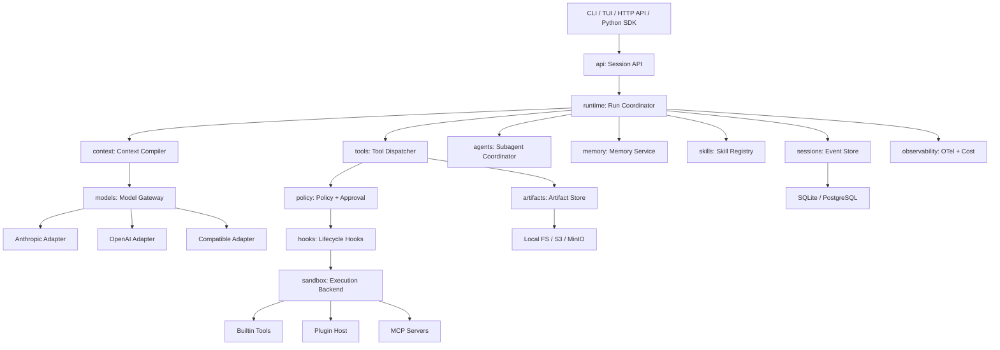

# AIHarness 架构设计

状态：Accepted / 实施中
版本：v0.1
日期：2026-08-04

## 1. 定位与目标

AIHarness 是面向 Coding Agent 的运行时基础设施。模型只负责生成意图，Harness 负责：

- 持久化会话、恢复、分支和审计；
- 上下文预算、自动压缩和大型输出管理；
- Provider 适配、多模型路由和成本控制；
- 工具注册、插件、MCP、Skill、Hook 和 Subagent；
- 策略决策、审批、能力租约和沙箱执行；
- 记忆、评估、事件回放和可观测性。

### 1.1 非目标

- 不在核心层绑定某个模型厂商或 Agent 编排框架；
- 不把完整历史覆盖成摘要；
- 不把第三方插件代码直接加载进 Harness 主进程；
- 不把 Host 执行描述成真正的安全隔离；
- 不在第一阶段构建复杂 TUI、聊天渠道或控制台。

## 2. 总体拓扑



控制面决定执行计划和上下文；执行面承载有副作用的工具、Hook 和插件。所有副作用必须
经过 `tools → policy → hooks → sandbox` 链路。

## 3. 工程目录

```text
src/aiharness/
  core/                 # Canonical types, events, IDs, errors
  runtime/              # Agent state machine, run coordinator
  sessions/             # Event store, snapshots, branching
  context/              # Context compiler and compaction strategies
  models/               # Gateway, router, provider adapters
  tools/                # Tool contract, registry, dispatcher
  plugins/              # Manifest, discovery, plugin host
  policy/               # Rules, decisions, approvals, capability leases
  hooks/                # Lifecycle event bus
  sandbox/              # Backend protocols and implementations
  memory/               # Extraction, retrieval, scopes
  skills/               # SKILL.md discovery and loading
  agents/               # Subagent task graph and coordination
  artifacts/            # Large output and patch storage
  observability/        # OTel, logging, cost accounting
  evals/                # Datasets, replay, graders
  api/                  # FastAPI optional service
  cli/                  # Typer CLI
tests/
  unit/
  contract/
  integration/
  security/
  evals/
docs/
  rfcs/
  adr/
plugins/
examples/
```

依赖方向：`core` 不依赖其他业务包；领域包依赖 `core`；`runtime` 组装依赖；`api/cli`
只调用公共 Runtime API。Provider、Sandbox、Store 和 Plugin Host 只能通过协议访问。

## 4. Runtime 与 Agent Loop

一次用户请求对应一个 `Run`，一次会话可以有多个 Run。Runtime 是可恢复状态机：

```text
ACCEPTED
  → CONTEXT_COMPILED
  → MODEL_STREAMING
  → MODEL_COMPLETED
  → TOOL_CALLS_PROPOSED
  → POLICY_EVALUATED
  → APPROVAL_PENDING / TOOL_EXECUTING
  → TOOL_RESULTS_COMMITTED
  → CONTEXT_COMPILED
  → COMPLETED / FAILED / CANCELLED / INTERRUPTED
```

核心顺序不可交换：

1. 先追加 `assistant.message`，再执行模型提出的工具；
2. 每个 Tool Call 最终必须对应一个 Tool Result；
3. 工具结果和权限决定在执行后立即落盘；
4. 流式增量用于 UI，不作为每 Token 的持久事件；
5. 取消或进程崩溃后，下一次 Resume 必须修复孤儿 Tool Call。

### 4.1 取消与恢复

取消流程必须收尾所有在飞任务，给未完成 Tool Call 合成错误结果，并追加
`run.interrupted`。进程直接退出时，Session Load 会扫描未配对调用并生成
`session.repaired`。不得自动重放未知是否已产生副作用的工具。

## 5. 核心契约

### 5.1 Canonical Types

`core` 只定义厂商无关类型：

- `Message`、`TextBlock`、`ThinkingBlock`、`ImageBlock`；
- `ToolCallBlock`、`ToolResultBlock`；
- `ModelRequest`、`ModelResponse`、`Usage`、`Capabilities`；
- `ToolSpec`、`ToolResult`、`Event`。

所有类型必须支持稳定 JSON 序列化和无损往返。Provider 的签名、加密推理载荷等放在
`ThinkingBlock.opaque`，只由对应 Adapter 解释。

### 5.2 Event

事件统一包含：

```text
event_id, session_id, run_id, seq, type, schema_version, created_at, data
```

事件是事实源；Projection、Snapshot、Trace 和 Eval 都从事件产生。

推荐事件类型：

```text
session.created / session.forked / session.repaired
run.started / run.completed / run.failed / run.interrupted
user.message / assistant.message / tool.result
model.requested / model.completed / usage.recorded
tool.requested / tool.started / tool.completed
policy.decided / approval.requested / approval.resolved
capability.lease.issued / capability.lease.revoked
context.compaction_started / context.compacted
compaction.created (trigger: budget | preflight_context_window | provider_context_length)
artifact.created / artifact.deleted
memory.candidate / memory.written
subagent.started / subagent.completed
```

## 6. 会话与存储

`sessions` 保存元数据和 `head_seq`；`events` 按 `(session_id, seq)` 追加。追加必须携带
`expected_seq`，冲突时拒绝写入。单会话由一个 Runtime Owner 写入，生产 Worker 通过 lease
保证所有权。

- 本地：SQLite WAL，单文件、事务、可备份；
- 生产：PostgreSQL，使用同一 Store Protocol；
- 大型输出、Diff、附件和日志：Artifact Store；
- Snapshot：按事件数量或时间生成，只用于加速 Load，不取代事件。

Branch 通过父 Session + 起始序号表达；父会话不可变，子会话只追加自己的事件。

## 7. 上下文与自动压缩

Context Compiler 将系统指令、项目约定、Skill 摘要、记忆、历史消息、工具 Schema 和
当前用户输入编译成模型请求，并在编译前计算预算：

```text
usable_input = context_window - reserved_output - tool_schema - safety_margin
```

压缩按成本递增：

1. 输出外置：大工具结果写入 Artifact，仅保留预览和引用；
2. 确定性微压缩：清理旧工具结果和重复上下文；
3. 语义压缩：通过 `SummaryGenerator` 协议生成结构化摘要；默认使用无网络
   `DeterministicSummaryGenerator`，可替换为专用 Compact Model。

结构化摘要至少保留目标、约束、决策、文件变化、验证结果、未解决事项、下一步、
权限模式、Skill、Subagent 和 Artifact 引用。压缩记录源事件范围、摘要策略、Prompt Hash、
前后 Token 估算、摘要版本和触发原因。Provider 返回 Context Length 错误时，每个 Run 最多
执行一次响应式 L2 压缩；第二次错误直接失败。压缩不得切断 Tool Call/Tool Result 配对。

Artifact Store 使用不可变内容摘要校验 Payload，并在 Manifest 中记录 `ArtifactPolicy`：
`run`、`session` 或 `persistent` Retention，以及可选过期时间。Runtime 产生的上下文 Artifact
默认绑定当前 Session；读取、删除和过期清理由带有匹配 `ArtifactAccess` 的调用执行。相同内容
在不同 Session/Run 的作用域下使用不同 Artifact ID，避免内容寻址去重跨越权限边界。
`expires_at` 是硬过期边界：过期条目立即拒绝读取并从普通列表隐藏，清理器只负责物理回收。
Runtime 的删除和过期清理入口追加 `artifact.deleted`，原始 `artifact.created` 事件不覆盖；
Store 的 `delete` 仅是受控物理存储原语，不绕过 Runtime 审计。

## 8. Models：多模型适配与路由

`ModelGateway` 不直接依赖具体 SDK。Provider Adapter 实现：

```text
capabilities(model)
stream(ModelRequest)
count_tokens(ModelRequest)
```

Capability 包含 Streaming、Tool Calling、Parallel Tools、Reasoning、Vision、Prompt Cache、
Token Counting、Context Window、Max Output 和 Effort Levels。

路由按角色配置独立模型：

```text
primary / fallback / compact / vision / memory / judge / subagent
```

第一阶段实现 Fake Provider；随后实现 Anthropic、OpenAI 和 OpenAI-Compatible。Fallback 只能
在模型请求尚未产生可执行 Tool Call 时自动发生；有副作用的工具结果不得盲目重放。

## 9. Tools、Plugins、Skills 与 Hooks

### 9.1 Tools

每个工具声明名称、描述、JSON Schema、是否修改外部状态、并发安全、能力需求、超时和
幂等策略。所有输入先校验和规范化，再进入 Policy。

### 9.2 Plugins

Plugin 使用 `plugin.json` 描述 Manifest Version、ID、SemVer、Harness API 约束、能力、权限、
Entry Point 和可选内容 Hash。Discovery 只读取 Manifest 并对 Manifest 之外的文件做确定性
Hash，不 import 或执行第三方代码。第三方插件由独立 Plugin Host 子进程加载，通过 JSON-RPC
或等价协议通信。项目级插件默认关闭；启用前必须对精确的
`plugin_id@version+manifest_sha256+content_sha256` 记录显式 Trust，并写入原子更新的
lockfile；Manifest 或内容 Hash 变化后自动失效。
真正激活前必须重新 Discovery/Hash 校验候选快照，防止 Trust 记录和 Host 启动之间的 TOCTOU。

Host 激活还必须通过显式 `PluginHostPolicy`：Manifest 的 `capabilities` 和 `permissions` 必须
分别是当前 Run 允许集合的子集，否则拒绝启动。Host 使用最小环境、无 Shell 的独立进程组和
有界 JSON-lines JSON-RPC（`aiharness.plugin.v1`）；超时、协议错误、崩溃都会终止整个进程组。
主进程只持有 `PluginRemoteTool`，Tool 调用仍由 `ToolDispatcher` 统一执行；Plugin Host 不得
直接授予 Policy、Approval、Capability Lease 或 Sandbox 权限。

### 9.3 Skills

兼容 `SKILL.md` + 严格 frontmatter。frontmatter 当前只允许 `name`、`description`、
`version`、`allowed_tools`、`required_permissions` 和 `tags`；不支持脚本入口或可执行指令。
Skill 按 `builtin < user < project < workspace` 分层发现，高层同名 Skill 遮蔽低层版本，
同层重复则拒绝启动。Discovery 只保留索引元数据和内容 Hash，不把 Markdown 正文放入候选对象。

启动或编译上下文时只注入 Skill 索引（名称、描述、版本和作用域）。正文必须由调用方显式请求，
并经过精确的 `name@version+scope+content_sha256` Trust、重新 Discovery/Hash 校验后才能加载；
未请求、未信任、已禁用或发生变更的 Skill 一律拒绝。Skill 内容只能作为当前 Run 的知识输入，
不能扩大工具、Policy、Approval、Capability Lease 或 Sandbox 权限。

### 9.4 Hooks

生命周期包括 `RunStart`、`BeforeModel`、`AfterModel`、`BeforeTool`、`AfterTool`、
`PolicyDecision`、`BeforeCompact`、`AfterCompact`、`Subagent*` 和 `RunStop`。
Hook 注册必须声明来源、稳定 ID、优先级、超时、失败策略和只读/可修改属性；执行顺序为
`priority` 升序、注册序号升序。每个 Hook 都收到独立的不可变事件快照，超时会取消在飞任务。
失败策略只有 `fail_fast` 和 `continue`，结果包含逐 Hook 的成功、耗时和错误码。

有副作用的 Hook 必须显式 Trust，并且只能在调用方提供的 `HookGovernance` 中执行；治理证据
至少包含已通过 Policy 的决定和 Sandbox 描述，可选绑定 Approval 与 Capability Lease。Hook
不能自行创建治理证据、修改事件输入或绕过 `tools → policy → hooks → sandbox` 链路。

### 9.5 MCP

MCP Client/Server 使用 JSON-RPC 2.0 边界，当前实现覆盖 `initialize`、`tools/list`、
`tools/call` 和初始化通知；传输通过 `McpTransport` Protocol 注入，内置内存传输仅用于契约测试，
不把网络或第三方 MCP SDK 引入 Core。Server Tool Schema 必须是对象 JSON Schema，并将
`readOnlyHint`、`destructiveHint`、`idempotentHint`、`openWorldHint` 映射到 canonical `ToolSpec`。

MCP 远程工具只能通过 `McpRemoteTool` 注册到 `ToolRegistry`，因此调用统一经过
`tools → policy → hooks → sandbox` 链路；直接 `McpClient.call_tool` 是低层传输 API，不得作为
Runtime 的模型工具入口。缺少明确 `readOnlyHint=true` 的远程工具按可变更工具处理。

断线重连最多按配置次数执行；只读工具可以重试，可能产生副作用的工具绝不自动重放，避免远端
已经执行成功但响应丢失时造成重复副作用。连接、协议、远端错误统一映射为稳定 MCP 错误类型。

## 10. Policy 与 Sandbox

Policy 输出 `ALLOW / DENY / ASK`，同时返回原因、命中的规则、作用域和有效期。硬拒绝优先于
组织、工作区、用户和会话临时授权。路径要 canonicalize，并检查 symlink escape；命令工具
不能只靠字符串黑名单。

Approval 与 Capability Lease 都是 append-only 授权事件的投影，并绑定单个 `run_id`。
两者在过期或撤销后失效；Runtime 在每次工具调用前从 Session 事件重建有效授权，不能把
未持久化的内存授权当作事实源。Approval 的请求和解决结果分别记录，只有匹配 pending
请求的单次 granted 结果才会产生有效授权；默认 ASK 会追加 `approval.requested`。

### 10.1 已确认的沙箱基线

- `HostBackend` 是本地首选，适合最小依赖和快速启动；
- Host 执行必须显式 `unsafe=true`，未显式声明时拒绝；
- 每个 `run.started`、`tool.started` 事件记录 `sandbox=host, unsafe=true`；
- Host 仅提供工作区路径约束、超时、输出上限和进程组清理，不宣称系统隔离；
- `LocalIsolatedBackend` 是可选的 OS-native 本地后端：Linux 使用 bubblewrap namespace，macOS
  使用 Seatbelt；它必须在 launcher 能力探测成功后才构造，默认隔离网络、进程并限制 workspace
  外写。`filesystem_write_isolated`、`network_isolated`、`process_isolated` 和 mechanism 都写入
  `SandboxDescriptor`；本地后端仍可能读取主机只读文件，不能把它描述成完整的文件机密边界；
- `DockerBackend` 是可选后端，要求真实隔离的部署通过策略禁止 Host；
- 本地 launcher 不可用或能力不足时必须 fail closed，禁止静默降级为 Host；要求完整文件系统
  隔离的 Policy Profile 只能选择具备 `filesystem_isolated=true` 的后端（通常是 Docker）；
- 后续可加入 gVisor、Firecracker 或 Kubernetes Worker。

Docker 参数必须以 argv 形式构造，默认 `--network none`、只读容器根、`no-new-privileges`、
丢弃 capabilities、PID/内存/CPU 上限和独立 `/tmp`；workspace 作为唯一显式 bind mount，事件
记录 image、network 和 mount 作用域。Docker CLI/Daemon 不可用时构造或执行失败，不回退到 Host。
Worktree 只表达子任务的 `task_id`、base commit、canonical root 和 allowed paths；PatchArtifact
只引用外置 diff Artifact、base commit、变更路径和 SHA-256。应用 Patch 前必须通过
`WorktreePatchBoundary` 校验任务归属、base commit、`.git` 禁止路径和 allowed paths；本步不自动
创建 Git Worktree、不自动合并 Patch。

执行链：

```text
Schema Validate
→ Canonicalize
→ Policy Preflight
→ BeforeTool Hook
→ Policy Re-evaluate
→ Approval
→ Capability Lease
→ Sandbox Execute
→ AfterTool Hook
→ Persist Result
```

## 11. Memory 与 Agents

Memory 分为 Working、Episodic、Semantic、Procedural 四层。长期记忆必须带作用域、来源、
置信度、时间和可删除标记；写入前做 Secret/PII 清洗、去重和人工可追溯。候选抽取与持久写入
分离：只有显式 `memory.written` 才进入 Durable Store，`memory.candidate` 仅记录待确认提案。
当前基线提供确定性显式记忆提取器、作用域访问控制、词法检索和 tombstone 删除；Memory
写入必须带匹配的 `MemoryAccess`，并由 Store 端再次清洗和深拷贝；原始内容不得绕过清洗器
进入长期记忆。Memory 事件由调用方追加到 Session Event Store。
`MemoryService` 默认要求可用的审计事件 Sink；只有明确设置 `audit_required=false` 的离线工具
才允许 best-effort 写入。

Subagent 是父 Run 下的独立 Task/Run 节点，权限只能是父节点的子集，拥有独立预算、上下文、
工作区或 Git Worktree。当前基线用可快照的 `TaskGraph` 管理 `PENDING → RUNNING → WAITING →
COMPLETED/FAILED/CANCELLED/INTERRUPTED` 状态，并通过结构化 `TaskSpec`、有界 FIFO `Mailbox`
和 `TaskResult` 协作。子任务的 capability、Token/成本/超时/Tool Call 预算、只读工作区和最大
深度在创建时校验，不能由子代理自行扩大；Mailbox 的发送者和接收者必须属于同一图，消息先进入
in-flight 状态，消费方显式 ack 后才删除。取消会递归收尾活动后代，Interrupted 只能显式 Resume，
图和 Mailbox 快照可用于进程重启恢复。M6a 尚不启动真实多 Worker 或 Docker；后续 Worker 必须
从这些持久化边界恢复，不能把本地线程状态当作事实源。

## 12. Eval 与 Observability

每个 Session、Run、Model Attempt、Tool Call、Policy Decision、Hook、Sandbox 和 Compaction
都带 Trace Context。使用 OpenTelemetry 输出 Trace、Metrics 和结构化日志，敏感字段先脱敏。

当前 M7a 提供不绑定厂商的 `TraceContext`、`Observation`、`MetricPoint`、`CostRecord` 和
`TelemetrySink` Protocol。`Telemetry` 通过 Session 的已持久化 Event observer 旁路记录事件，
不会改变事件顺序、Policy 或 Sandbox 决策；observer 收到的是深拷贝，观测异常 fail-open。内存
Sink 有记录上限，Redactor 对 Secret-looking key、Bearer/API token、非有限数字、超长内容和未知
对象 fail-closed。成本按 Usage 与每千 Token 价格确定性计算，拒绝负数、非有限或溢出结果。后续
OTel adapter 必须保持这些 canonical 字段和脱敏边界；自定义 Sink 应为有界、非阻塞实现。

M7b 提供 `TraceBundle`、`ReplayEngine`、`EvalDataset`、`EvalRunner` 和确定性 `Grader`。TraceBundle
只接受显式 `redacted=true` 的单 Session 事件，构造时递归冻结、再次按 canonical Redactor 规范化，
并对完整规范化 JSON 计算 SHA-256；加载或回放前发现 Hash、Schema、序列号或 Session 不一致即拒绝。
ReplayEngine 只投影 Run/Tool/Message 状态，不调用 Provider、Tool、Plugin 或 Sandbox；拒绝跨 Run 工具
生命周期、重复终态和 Ephemeral 事件，但允许 Policy 拒绝后仍持久化对应 Tool Result。Grader 只消费
ReplayResult，分数必须是有限的 `[0,1]` JSON 数值。

M7c 提供 `JsonlTelemetrySink` 和可选 `OpenTelemetrySink`。Exporter 在边界再次脱敏，Metric/Cost
保留 canonical `unit`，数值溢出或缺少 OTel API 时 fail closed；核心仍不强制安装 OTel。`GoldenTask`
与 `GoldenTaskGrader` 只检查 ReplayResult 的事件类型、Run 状态和未完成 Tool，不启动 Provider、Tool
或 Sandbox。

M7d-a 提供离线 `ProviderGoldenTask`、`ProviderTranscript` 和 `ProviderGoldenRunner`。Runner 只消费
Provider-neutral stream chunks；消息 ID、工具调用 ID 和请求内容不进入可审计 fixture，request
fingerprint 由脱敏 canonical request 计算。Runner 将 Provider 异常降为稳定 error code，不重试或重放
任何副作用。`EvalGate` 对 Provider 或 Replay 结果生成严格 JSON `GateVerdict`，空数据、阈值不足和
失败 case 可在 CI 中阻断。真实远程 Export pipeline、认证、批量重试和外部 Provider 仍须由后续适配层
提供。

M7d-b 提供 `OtelBatchPipeline` 和 `OtlpHttpTransport`。Pipeline 将 `Observation` 再次脱敏后放入有界
队列，背压策略必须显式选择 `raise`、`drop_newest` 或 `drop_oldest`；批量传输只对标记为 retryable
的错误做有限指数退避，重试耗尽以稳定错误码结束并记录丢弃数，不能阻塞 Event Store。`OTelResource`
统一 service/environment 属性，`W3CTracePropagator` 严格校验 W3C `traceparent`；Bearer token 只
存在于发送时的 Authorization header，不进入 Observation、resource 或错误详情。OTLP/HTTP JSON 适配
负责 resource、span、metric 和 log envelope，HTTP client 可注入以便离线契约测试；Runtime 不自动
打开远程网络出口。

M7e-a 将 Pipeline 接入 Runtime 生命周期：`RunCoordinator` 在 `run.completed`、`run.failed` 或
`run.interrupted` 事件追加后统一调用 `Telemetry.flush()`；flush 失败只作为观测侧失败，不改变已
持久化的 Run 结果。共享 sink 不会在单个 Run 中关闭，进程或 Worker 退出时由宿主显式调用
`Telemetry.close()`。`WorkerTraceManager` 使用父 Run TraceContext 为每个 Worker attempt 创建新的
child span，外部 Worker 恢复时严格解析传入的 W3C `traceparent` 并重新生成 span ID；该上下文只用于
可观测性关联，不改变 TaskGraph 的权限、预算、Lease、Policy 或 Sandbox。

M7e-b 将 `WorkerLeaseTraceBridge` 放在 RunLeaseStore 与 IPC 适配之间。`WorkerLeaseEnvelope` 只携带
严格 schema 的 lease identity、expiry、fencing token、attempt 和 W3C `traceparent`；bridge 在取得
Lease 前解析外部 parent carrier，取得/续租/释放仍调用原有 fenced store。Lease takeover 产生新的
Worker child span，旧 fencing token 仍然无法续租或释放；跨进程恢复没有 parent carrier 时 fail closed。
Envelope 是可序列化关联数据，不是授权凭据；IPC/HTTP 通道、认证和网络策略由宿主显式注入。

评估支持 Fake/Replay、Provider Contract、Golden Tasks、安全测试和 Coding Tasks。核心指标：

- 任务成功率、测试通过率和 Patch 正确率；
- 恢复成功率、孤儿 Tool Call 率；
- 压缩前后 Token、上下文保持率；
- Tool 错误率、策略拒绝率、审批率；
- 首 Token 延迟、总延迟、Token 和成本。

## 13. 技术与部署

首选 Python 3.11+、asyncio/AnyIO、Pydantic v2、SQLite/PostgreSQL、Typer、可选 FastAPI、
OpenTelemetry、structlog。第一形态是可嵌入 SDK + CLI；第二形态将 Runtime、Sandbox Worker 和
Plugin Host 拆分部署。核心不强依赖 LangChain/LangGraph，保持对 Provider 和执行面的控制。

### 13.1 服务化控制面与 Worker Lease

FastAPI 是可选的内部控制面适配器，由 `create_app` 注入 `EventStore`、`RunLeaseStore` 和可选
`ArtifactStore`。它只暴露 Session 事件读取、Approval 请求/解决、Run lease 和受作用域保护的
Artifact 查询，不直接调用 Tool、Provider 或 Sandbox；公网部署必须在 Harness 外配置认证、授权、
TLS、限流和审计。`/sessions/{session_id}/artifacts` 只列出该 Session 的 `session` 作用域 Artifact；
`run` 作用域 Artifact 必须通过带匹配 `run_id` 的已知 Artifact 查询访问，`persistent` Artifact 不
通过 Session 路由泄露。

SQLite 和 PostgreSQL 遵循同一个 `EventStore` Protocol。PostgreSQL 适配使用事务内
`SELECT ... FOR UPDATE` + `expected_seq`，并在查询后结束事务；驱动通过可选 `psycopg` 或注入的
DB-API connection factory 提供，核心包不强制安装数据库驱动。连接、唯一约束和 JSON 序列化错误
映射到稳定 Harness 错误，原始事件仍是唯一事实源。

Worker 使用 Run-scoped lease 和单调 fencing token。持有者必须提供 owner 与 token 才能续租或
释放；过期 lease 可被另一 Worker 接管，旧 Worker 的续租/释放一律拒绝。Lease 不是工具授权，
每次副作用仍须经过 `tools → policy → hooks → sandbox`，后续多 Worker 实现必须把 lease 状态和
事件提交放入同一可恢复的控制面。
