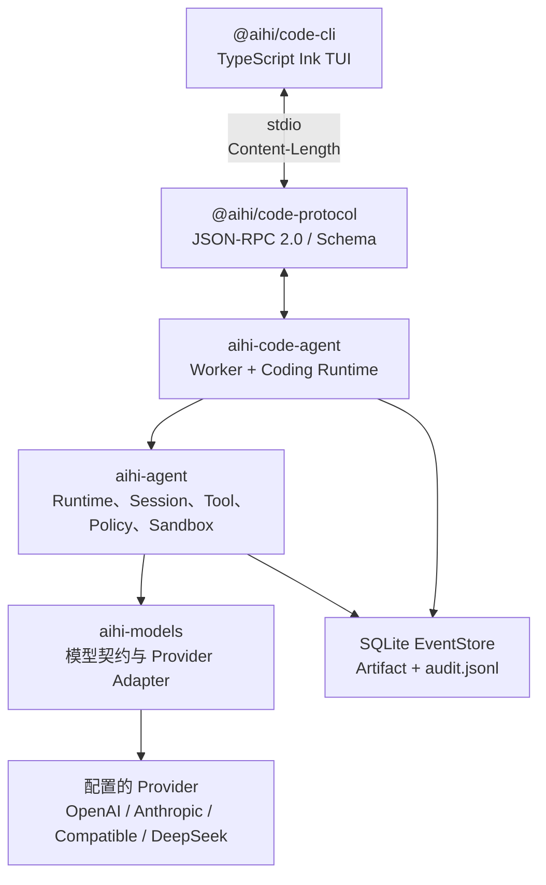

# AIHI 架构

[English](ARCHITECTURE.md) | **简体中文**

> AIHI monorepo 的稳定架构、公共边界和安全不变式。

| 字段 | 内容 |
| --- | --- |
| 状态 | 当前基线 |
| 范围 | `aihi-models`、`aihi-agent`、`aihi-code-agent`、`@aihi/code-protocol`、`@aihi/code-cli` |
| 运行时 | Python 3.11+；TypeScript/Ink CLI |
| 协议 | Code Protocol 0.3 |
| 事实源 | Runtime 使用事件日志；本文描述稳定边界 |

本文说明契约、职责、依赖方向和安全不变式。交付进度见 [TASK.md](TASK.md)；`docs/adr/` 和
`docs/rfcs/` 下的 ADR/RFC 仅作为本地工作记录，已被 Git 忽略，不会发布到 GitHub。

## 目录

- [产品边界](#产品边界)
- [系统拓扑](#系统拓扑)
- [仓库结构](#仓库结构)
- [包职责](#包职责)
- [Runtime 与事件模型](#runtime-与事件模型)
- [模型与 Provider](#模型与-provider)
- [Context Cache 与 Compaction](#context-cache-与-compaction)
- [工具与安全](#工具与安全)
- [Skill、MCP 与扩展](#skillmcp-与扩展)
- [Coding Worker 与 TUI 协议](#coding-worker-与-tui-协议)
- [持久化与可观测性](#持久化与可观测性)
- [扩展规则与质量门禁](#扩展规则与质量门禁)

## 产品边界

AIHI 是可复用的 Agent Harness。模型生成意图，Harness 将意图转换为持久化、可治理、可恢复的
Run；具体应用负责 Prompt、项目规则、Provider/Model profile、产品工具和用户交互。

```text
aihi-models → aihi-agent → 应用层 Runtime → 用户界面
                           (aihi-code-agent) (@aihi/code-cli)
```

首个产品是 Coding Agent，未来 Cowork 等产品应复用 Harness，而不是复制 Runtime。

### 基础包负责

- Provider-neutral 模型消息、能力、流式协议和 Adapter。
- 可恢复 Session、事件溯源 Run、Replay、分支和审计。
- 上下文编译、Token 预算、Compaction 和 Artifact 生命周期。
- Tool 契约、Policy、Approval、Sandbox、Hook、Skill、MCP、Plugin 和 Subagent。
- 本地 Coding Worker 以及消费 Worker 协议的 TypeScript TUI。

### 基础包不负责

- `ModelRouter`、`ModelGateway`、Model roles 和跨 Provider fallback。
- 产品 Prompt、项目约定、默认模型及产品工具集。
- TUI、Web/Desktop UI 和聊天渠道。
- 把 `HostBackend` 描述成安全隔离沙箱。

这些选择属于应用层或未来的 Adapter 层，基础包必须保持 Provider-neutral 且不依赖应用。

## 系统拓扑



所有副作用都必须经过：

```text
Tool input → 校验/Prepare → Policy/Approval → Hook → 受治理的 Tool 执行 → 持久化 Tool Result
```

事件日志是事实源，模型响应和 TUI 内存都不是。

## 仓库结构

```text
packages/aihi/models         aihi-models；模型契约与 Provider
packages/aihi/agent          aihi-agent；Runtime、Session、Tool、安全链路
packages/aihi/code-agent     aihi-code-agent；位于 uv workspace 外的私有本地 Coding Worker 与应用组合
packages/aihi/code-protocol  @aihi/code-protocol；DTO 与 JSON Schema
apps/aihi-code-cli           @aihi/code-cli；Ink TUI
tests/                       契约、集成、打包和冻结 fixture
docs/                        架构与任务文档
```

Python 包使用 PEP 420 的 `aihi` namespace；namespace 根没有 `__init__.py`，每个叶子包维护
自己的 `__init__.py`、`__all__` 和 `py.typed`。

## 包职责

| 包 | 负责 | 不负责 |
| --- | --- | --- |
| `aihi-models` | Message、Model Request/Response、Usage、Capabilities、ModelToolDefinition、Provider Protocol、Adapter、codec | Agent Event、ToolSpec、Policy、Sandbox、Router/Gateway、模型选择、凭据 |
| `aihi-agent` | Agent loop、Session/EventStore、Context/Compaction、ToolSpec、Dispatcher、Policy、Approval、Sandbox、Artifact、Skill、Memory、MCP、Plugin、Subagent、Eval、Observability | 产品 Prompt、Provider profile、TUI、应用默认值 |
| `aihi-code-agent` | Coding 配置、Provider/Model catalog、Worker、RPC handler、Coding Tool 和应用组合 | 第二套 Runtime、Provider Adapter、UI |
| `@aihi/code-protocol` | 版本化 RPC method、DTO、Event guard、JSON Schema | Runtime 状态、持久化、Tool 执行 |
| `@aihi/code-cli` | Ink 展示、Slash 命令、Picker、Transcript 投影、输入状态和进程生命周期 | EventStore 写入、Policy 决策、模型调用、业务事实 |

跨包只使用各包顶层公共 API，禁止通过私有模块绕过边界。

## Runtime 与事件模型

一次用户请求创建一个 `Run`，一个 `Session` 可包含多个 Run：

```text
CREATED → RUNNING → WAITING_TOOL → RUNNING
                       │
                       ▼
                 WAITING_APPROVAL → WAITING_TOOL

RUNNING → COMPLETED | FAILED | INTERRUPTED | CANCELLED
```

`WAITING_APPROVAL` 是可恢复的挂起态；`INTERRUPTED` 可 Resume；`CANCELLED` 表示主动放弃，不可恢复。

### 稳定不变式

1. 执行 Tool 前先持久化 Assistant Tool Call。
2. 每个已执行 Tool Call 恰好产生一个持久化 Result；等待审批的调用保持 pending。
3. Policy 和 Tool 结果立即落盘；流式 chunk 仅作为 UI ephemeral event。
4. Resume 使用首次 `run.started` 固化的 Provider、Model、应用权限 Profile、Prompt 摘要和 output budget；
   对 Coding Agent，该 Profile 固化 Session Workspace、AccessMode、RunMode 与命令 Sandbox descriptor。
5. 取消或进程重启修复孤儿调用，但不盲目重放可能已产生副作用的 Tool。
6. 一个 Session 只有一个 writer，`seq` 单调递增，追加使用 `expected_seq` 检测冲突。

事件信封包含 `event_id`、`session_id`、`run_id`、`seq`、`type`、`schema_version`、`created_at` 和
`data`。新增可选字段兼容；删除或改变含义必须迁移；未知信封版本必须 fail closed。

## 模型与 Provider

`aihi.models.Provider` 是 Agent Runtime 唯一需要的模型边界：

```python
capabilities(model)
stream(ModelRequest)
count_tokens(ModelRequest)
```

当前 Adapter 包括 Fake、OpenAI、Anthropic、OpenAI-compatible 和 DeepSeek。DeepSeek 复用
OpenAI-compatible 实现，但必须使用明确 endpoint。

多个 Provider 和 Model 属于应用层决策。`aihi-code-agent` 从配置加载 catalog、校验所选 Model 并
提供 CLI 切换；CLI 不实现 Router 或 Fallback。首个 stream chunk 产生后不得静默重试或切换 Provider。

## Context Cache 与 Compaction

应用提供的 Base System Block 与规范化的模型可见 Tool Definition 构成稳定 Prompt Cache 前缀。
动态 Section、`ContextState`、Tool Result 占位符和当前 Turn 位于该边界之后，因此 Compaction
不会改变稳定 Cache Family。

`aihi.agent.context` 采用一条明确流水线：`models` 定义预算和投影记录；`assembler` 组装稳定前缀并约束
大型 Tool Result；`grouping` 定义闭合的 Tool Call/Result Exchange；`state` 与 `projector` 维护带证据的
累计状态；`summary` 与 `model_summary` 提供确定性或模型补充；`compaction` 执行替换；`compiler` 是
Runtime 门面。组装是确定性的，可以反复执行；只有 Compaction 才会做语义编辑并返回新模型输入投影。

Runtime 使用 `ContextBudget.input_capacity` 衡量完整规范化请求；该容量已经且只会一次性预留输出与安全
空间。默认策略在接近 60% 时请求精确计数，在 80% 做唯一一次 Compaction 决策，压缩后目标为 60%。规范
分组单位是能够闭合其中所有 Tool Call/Result 的最小消息序列，普通消息单独成组，因此一次 User 请求后接
几十轮 Assistant/Tool 循环也可以压缩。旧的闭合分组会被一个累计、带证据的 Schema v2 `ContextState`
替换。近期原文后缀只受 30%/32K Token 预算控制，并始终保留最新闭合分组；不再有固定 Turn 数下限。
状态自身限制在约 2K Token。首个状态形成后它就是权威输入：后续通过 `event_cursor` 只读取 EventStore
增量，并按事实的观测序号单调淘汰，不会从完整历史重新插入已删除事实。

注入 Artifact Store 时，大型 Tool Result 会外置并按 Artifact 身份复用；未注入时，组装器也会生成带
大小与摘要指纹的有界 Head/Tail 投影，而原始 Message Event 保持不变。Compact Model 分块使用有界并发，
并按 Chunk 降级以保留其他成功摘要。不再存在第二套 Pruning 模块或 Runtime 阶段。模型只能补充语义约束
和下一步；文件修改、验证收据、失败和审批仍只能来自不可变 Event、Tool Metadata 与 Artifact Manifest。

每次实际替换只产生一个持久化 `compaction.created` Record；原始 Message 和 Tool Result Event 永不重写。
Cache 可观测数据仍会持久化，但不包含 Prompt 或完整 Cache Key：每个 `model.usage` Event 记录 Provider
上报的 Cache Read/Write Token、Cache Family Key 的 SHA-256、完整请求压力和 Compaction 决策；Eval 汇总
Cache Hit Ratio、Cache Key 变化次数与滚动 Compaction 次数。

## 工具与安全

`aihi.models.ModelToolDefinition` 只包含模型可见的名称、描述和 JSON Schema；
`aihi.agent.tools.ToolSpec` 额外声明 mutation、并发、幂等性、能力、超时和审批治理字段。

| 类别 | 示例 | 默认行为 |
| --- | --- | --- |
| 只读 | `read_file`、`glob`、`grep` | 所有 AccessMode/RunMode 均允许，声明并发安全时可并行 |
| 工作区修改 | `write_file`、`edit_file` | `read_only`/`plan` 拒绝；`workspace_write`/`full_access` 允许 |
| 进程执行 | `bash` | `read_only`/`plan` 拒绝；`workspace_write` 为 ASK；`full_access` 为 ALLOW |

Policy 输出 `ALLOW`、`DENY` 或 `ASK`。`ASK` 会持久化 `approval.requested` 并挂起 Run，由应用提供
人工 Resolver。Approval 和 Capability Lease 按 `run_id` 作用域化，Resume 时从事件重建；一次性
Approval 只能消费一次。Coding Workspace 是 Session 中以应用自有 metadata 持久化的 canonical cwd；
基础 Harness 只负责不透明地持久化和 Fork 这些 metadata，不提供 cwd 属性或 Workspace 语义。TOML 只能
从该目录发现配置，不能定义另一套 Workspace。文件 Tool 通过应用 Context 规范化路径并在本地执行，只有 Bash
持有 Sandbox backend。`HostBackend` 需要显式 `unsafe=true`，只提供命令 cwd、超时、输出上限和进程组
清理，不提供系统隔离；Docker 命令执行在能力不可用时 fail closed。

基础 Harness 只治理子级预算与能力子集、深度和子任务数量；cwd 和应用权限对它是不透明值。Code Agent
让子 Run 保持父级 Session 的 canonical cwd，并注入子级 `CodeAgentPermissionContext`：获批能力决定
请求的 AccessMode，父级 AccessMode 是上限，而 Plan 强制生成只读的 Plan 子 Run。

## Skill、MCP 与扩展

可选能力通过 `RuntimeExtensions` 接入：Skill 先发现元数据和 Hash，正文只有被显式请求才加载；
内置 Skill 由包完整性隐式信任，用户/项目/Workspace Skill 必须精确 trust。MCP 和 Plugin Tool
注册后经过统一 ToolRegistry、Policy 和 Hook 链路；需要执行任意命令的 Tool 必须显式持有应用注入的
命令 Sandbox。Plugin 在独立受限 Host 进程中激活；
Memory 作用域化且写入需要授权；Subagent 以受治理的 `task` Tool 在独立 Session 中运行。

## Coding Worker 与 TUI 协议

`aihi-code-agent` 是应用 Runtime 和 EventStore 唯一写入端；`@aihi/code-cli` 是薄客户端。两者通过
Code Protocol 0.3 的 stdio 通讯：

- JSON-RPC 2.0、`Content-Length` framing 和精确版本 handshake。
- `run.start`/`run.resume` 立即返回包含 `run_id` 的 acceptance。
- 进度和终态由版本化 notification 传递，启动前失败使用 `run.error`。
- Session descriptor 直接暴露 canonical cwd；Config descriptor 暴露应用拥有的 Access/Run Mode 和
  `command_sandbox`；Run descriptor 暴露持久化后的实际生效模式。
- Task DTO 只包含通用委派范围，不携带 Workspace 权限。
- 重连先完整分页 `session.events(after_seq)`，再接收实时通知。
- TUI 的 replay 和实时事件共用 reducer，按 `seq` 去重，以 canonical `assistant.message` 覆盖临时 `model.chunk`。

TUI 只拥有 viewport、折叠 Tool 输出、Slash 补全和草稿历史等展示状态；用户消息及 Runtime Event
由 Worker 持久化。

## 持久化与可观测性

默认使用 SQLite WAL；大型输出、Diff 和附件存入 Artifact Store，并带 Session/Run retention 和
访问检查。Snapshot 与 Compaction 只是派生加速数据，不替代原始事件。Event envelope v2 从
`subagent.spawned` 的 Task payload 中删除旧的 Harness-owned Workspace；envelope v3 从
Run/Tool/Approval/Compaction Event 中删除 Runtime 全局 Workspace、Sandbox 和权限模式字段。应用权限
保留在不透明 Run profile 中，命令 Sandbox 事实保留在 Tool 自有 execution metadata 中；注册的
v1 → v2 → v3 migration 继续读取冻结 Session，而不会恢复已退役的基础层概念。`audit.jsonl` 是本地脱敏、
尽力而为的运维日志，不能成为事实源；`/doctor` 检查审计目标及其父目录可写性。Trace、Replay 和
Eval 只处理脱敏事件 Bundle，不重新执行 Tool 或 Provider。

## 扩展规则与质量门禁

新增能力时先判断是否 Provider-neutral 且可跨产品复用，再定义协议、事件和失败语义；产品默认值
和 UX 留在应用层；所有副作用保持 `tool → policy → hooks → 受治理执行` 链路，只有执行任意命令的 Tool
才注入命令 Sandbox；公共符号必须先有兼容性、
安全性和 installed-package 测试。

```bash
python3 -m compileall -q packages
python3 -m pytest
ruff check .
mypy
pnpm --dir apps/aihi-code-cli test
```

打包测试必须独立和组合构建、安装两个公开 wheel，验证 PEP 420、`py.typed`、依赖 metadata、
`aihi-code-agent` 的发布清单排除契约，并保证冻结 Event/SQLite/Trace fixture 可回放且不被重新生成。
契约测试直接读取三个 Python 包的源码：包导入上层、跨包深入对方私有或内部模块而非受支持公共面、
`__all__` 导出无任何绑定的名字，都会让构建失败。这些是 wheel 元数据查不出的——开发态下三个 `src`
都在 `pythonpath` 上，反向导入既能通过类型检查也能运行。

公开 PyPI distribution 只有当前版本为 `0.2.0` 的
[`aihi-models`](https://pypi.org/project/aihi-models/0.2.0/) 与
[`aihi-agent`](https://pypi.org/project/aihi-agent/0.2.0/)。`aihi-code-agent` 仍是可安装的私有本地应用，
位于 uv workspace 之外，供本地 Worker 和 CLI 使用，但不属于 PyPI release artifact。根 `pyproject.toml` 中的
`tool.aihi.release.python-distributions` 是公开发布清单的唯一事实源；code-agent 还声明
`Private :: Do Not Upload`，阻止误操作直接上传到 PyPI。

参见 [任务路线图](TASK.zh-CN.md) 和各包中文 README。
